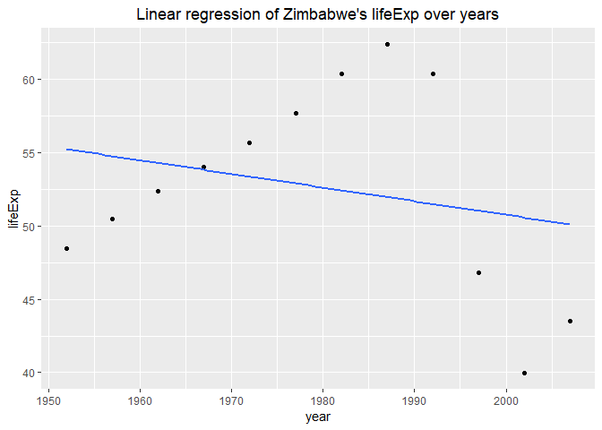
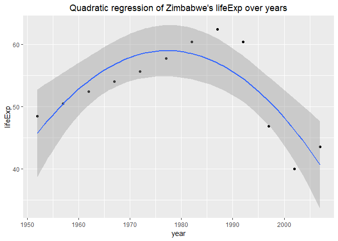

hw06- Data wrangling wrap up
================
Meiqi Yu

# Introduction

For this assignment, we have been tasked with two topics out of six.

# Load packages

``` r
suppressPackageStartupMessages(library(tidyverse))
library(knitr)
library(repurrrsive)
library(gapminder)
suppressPackageStartupMessages(library(leaflet))
suppressPackageStartupMessages(library(ggmap))
suppressPackageStartupMessages(library(MASS))
suppressPackageStartupMessages(library(stringi))
```

# First Task: Character data

I will work on the exercises in the [Strings
chapter](https://r4ds.had.co.nz/strings.html).

## Exercises in 14.2.5

### 1.In code that doesn’t use stringr, you’ll often see paste() and paste0(). What’s the difference between the two functions? What stringr function are they equivalent to? How do the functions differ in their handling of NA?

The difference can be seen by the example below.

``` r
paste("Hello","World")
```

    ## [1] "Hello World"

``` r
paste0("Hello","World")
```

    ## [1] "HelloWorld"

  - By `paste()`: There is a space between each string;
  - By `paste0()`: There is NO space between each string.

The equivalent stringr functions are shown beolow.

``` r
paste0("Hello","World")
```

    ## [1] "HelloWorld"

``` r
str_c("Hello","World")
```

    ## [1] "HelloWorld"

  - `paste0()`: equivalent to `str_c()`.

Now, let’s figure out how do these functions differ in their handling of
NA.

``` r
paste("Hello","World",NA)
```

    ## [1] "Hello World NA"

``` r
paste0("Hello","World",NA)
```

    ## [1] "HelloWorldNA"

``` r
str_c("Hello","World",NA)
```

    ## [1] NA

  - `paste()` and `paste0()`: see NA as a string and return all the
    strings incluing NA
  - `str_c()`: only NA is returned regardless of the other
strings

### 2.In your own words, describe the difference between the `sep` and `collapse` arguments to str\_c().

``` r
str_c(c("2018","SEP","1"),"Sunny",sep="-")
```

    ## [1] "2018-Sunny" "SEP-Sunny"  "1-Sunny"

``` r
str_c(c("2018","SEP","1"),"Sunny",collapse="-")
```

    ## [1] "2018Sunny-SEPSunny-1Sunny"

  - By `sep`: add the sep argument behind each string, the number of
    output is same to that of input;
  - By `collapse`: add the collapse argument behind each string and
    return all the strings together as one whole string, only ONE
    output.

### 3.Use str\_length() and str\_sub() to extract the middle character from a string. What will you do if the string has an even number of characters?

For strings with odd number of characters: extract the middle character
from the string.

``` r
x1 <- "abc" #odd number
n_x1 <- str_length(x1)
str_sub(x1,(n_x1+1)/2,(n_x1+1)/2)
```

    ## [1] "b"

For strings with even number of characters: extract the middle two
characters from the string.

``` r
x2 <- "abcd" # even number
n_x2 <- str_length(x2) # calculate the length of the strings
str_sub(x2,(n_x2)/2,(n_x2)/2+1)
```

    ## [1] "bc"

Now, an obvious question is: Can we extract the middle character in the
same way no matter the string has an odd or even characters?

The answer is YES\! It can be done by `ceiling()`.

``` r
x3 <- c("a", "abc", "abcd", "abcde")
n_x3 <- str_length(x3)
str_sub(x3, ceiling(n_x3/2), n_x3/2+1) #extract from the ceiling for the middle character
```

    ## [1] "a"  "b"  "bc" "c"

### 5\. What does str\_trim() do? What’s the opposite of str\_trim()?

  - `str_trim()` deletes the whitespace from a string.

<!-- end list -->

``` r
str_trim(" a b c ",side = "left") # delete from left
```

    ## [1] "a b c "

``` r
str_trim(" a b c ",side = "right") # delete from right
```

    ## [1] " a b c"

``` r
str_trim(" a b c ",side = "both")# delete from both
```

    ## [1] "a b c"

  - The opposite of `str_trim()` is `str_pad()`, which add whitespace(s)
    to a
string.

<!-- end list -->

``` r
str_pad("a b c",width=6, side = "left") # add left side,total width is 6
```

    ## [1] " a b c"

``` r
str_pad("a b c",width=7, side = "both") # add both side,total width is 7
```

    ## [1] " a b c "

### 6\. Write a function that turns (e.g.) a vector c(“a”, “b”, “c”) into the string “a, b, and c”. Think carefully about what it should do if given a vector of length 0, 1, or 2.

First, I write a function as below to turn a vector into a string as
required.

``` r
vector_to_string <- function(x){
   if(length(x) == 0){
    return(str_c("Please enter a vector")) # with vector of length 0, it's better to show a error information
  }
   if(length(x) ==1){
    return(x) # with vector of length 1, return itself
  }
   if(length(x)==2){
      str0=str_c(x[1],", and ",x[2])
      return(str0)
   }
   else{
      str1 <- str_c(x[1:length(x)-1],collapse=", ") # the first part of the string
      str2 <- str_c(str1,", and ", x[length(x)])
      return(str2)
   }
}
```

Now, let’s test it with vectors of length 0,1,2 or more.

``` r
str_0 <- c()
vector_to_string(str_0)
```

    ## [1] "Please enter a vector"

``` r
str_1 <- c("A")
vector_to_string(str_1)
```

    ## [1] "A"

``` r
str_2 <- c("A","B")
vector_to_string(str_2)
```

    ## [1] "A, and B"

``` r
str_3 <- c("A","B","C")
vector_to_string(str_3)
```

    ## [1] "A, B, and C"

## Exercises in 14.3.1.1

### 1\. Explain why each of these strings don’t match a : “",”\\“,”\\".

Regexps use the backslash, , to escape special
behaviour.

| String | Meaning                                                                                                                           |
| ------ | --------------------------------------------------------------------------------------------------------------------------------- |
| \\     | excape the next character                                                                                                         |
| \\     | resolve to  in the regular expression                                                                                             |
| \\\\   | the first two backslashes will resolve to a literal backslash in the regular expression, the third will escape the next character |

### 2\. How would you match the sequence "’?

``` r
x <- "\"\'\\"
str_view(x, "\\\"\\'\\\\") 
```

<!--html_preserve-->

<div id="htmlwidget-daf717028e9da30a342a" class="str_view html-widget" style="width:960px;height:100%;">

</div>

<script type="application/json" data-for="htmlwidget-daf717028e9da30a342a">{"x":{"html":"<ul>\n  <li><span class='match'>\"'\\<\/span><\/li>\n<\/ul>"},"evals":[],"jsHooks":[]}</script>

<!--/html_preserve-->

### 3\. What patterns will the regular expression ...... match? How would you represent it as a string?

``` r
x<-"\\..\\..\\.."
writeLines(x)
```

    ## \..\..\..

``` r
str_c(writeLines(x))
```

    ## \..\..\..

    ## character(0)

## Exercises in 14.3.2.1

### 1\. How would you match the literal string “\(^\)”?

``` r
x <- "$^$"
str_view(x, "^\\$\\^\\$$")
```

<!--html_preserve-->

<div id="htmlwidget-774eb11bc9ae6e059b07" class="str_view html-widget" style="width:960px;height:100%;">

</div>

<script type="application/json" data-for="htmlwidget-774eb11bc9ae6e059b07">{"x":{"html":"<ul>\n  <li><span class='match'>$^$<\/span><\/li>\n<\/ul>"},"evals":[],"jsHooks":[]}</script>

<!--/html_preserve-->

### 2.Given the corpus of common words in stringr::words, create regular expressions that find all words that:

1.  Start with
“y”.

<!-- end list -->

``` r
str_view(words, "^y", match =TRUE)
```

<!--html_preserve-->

<div id="htmlwidget-2cfa1c19f78e296d0b4f" class="str_view html-widget" style="width:960px;height:100%;">

</div>

<script type="application/json" data-for="htmlwidget-2cfa1c19f78e296d0b4f">{"x":{"html":"<ul>\n  <li><span class='match'>y<\/span>ear<\/li>\n  <li><span class='match'>y<\/span>es<\/li>\n  <li><span class='match'>y<\/span>esterday<\/li>\n  <li><span class='match'>y<\/span>et<\/li>\n  <li><span class='match'>y<\/span>ou<\/li>\n  <li><span class='match'>y<\/span>oung<\/li>\n<\/ul>"},"evals":[],"jsHooks":[]}</script>

<!--/html_preserve-->

2.  End with
“x”

<!-- end list -->

``` r
str_view(words, "x$", match =TRUE)
```

<!--html_preserve-->

<div id="htmlwidget-5ef0f07a4417c5ab7d8f" class="str_view html-widget" style="width:960px;height:100%;">

</div>

<script type="application/json" data-for="htmlwidget-5ef0f07a4417c5ab7d8f">{"x":{"html":"<ul>\n  <li>bo<span class='match'>x<\/span><\/li>\n  <li>se<span class='match'>x<\/span><\/li>\n  <li>si<span class='match'>x<\/span><\/li>\n  <li>ta<span class='match'>x<\/span><\/li>\n<\/ul>"},"evals":[],"jsHooks":[]}</script>

<!--/html_preserve-->

3.  Are exactly three letters long. (Don’t cheat by using
    str\_length()\!)

<!-- end list -->

``` r
str_view(words, "^...$", match = TRUE)
```

<!--html_preserve-->

<div id="htmlwidget-2157de3fa78f9c516cd4" class="str_view html-widget" style="width:960px;height:100%;">

</div>

<script type="application/json" data-for="htmlwidget-2157de3fa78f9c516cd4">{"x":{"html":"<ul>\n  <li><span class='match'>act<\/span><\/li>\n  <li><span class='match'>add<\/span><\/li>\n  <li><span class='match'>age<\/span><\/li>\n  <li><span class='match'>ago<\/span><\/li>\n  <li><span class='match'>air<\/span><\/li>\n  <li><span class='match'>all<\/span><\/li>\n  <li><span class='match'>and<\/span><\/li>\n  <li><span class='match'>any<\/span><\/li>\n  <li><span class='match'>arm<\/span><\/li>\n  <li><span class='match'>art<\/span><\/li>\n  <li><span class='match'>ask<\/span><\/li>\n  <li><span class='match'>bad<\/span><\/li>\n  <li><span class='match'>bag<\/span><\/li>\n  <li><span class='match'>bar<\/span><\/li>\n  <li><span class='match'>bed<\/span><\/li>\n  <li><span class='match'>bet<\/span><\/li>\n  <li><span class='match'>big<\/span><\/li>\n  <li><span class='match'>bit<\/span><\/li>\n  <li><span class='match'>box<\/span><\/li>\n  <li><span class='match'>boy<\/span><\/li>\n  <li><span class='match'>bus<\/span><\/li>\n  <li><span class='match'>but<\/span><\/li>\n  <li><span class='match'>buy<\/span><\/li>\n  <li><span class='match'>can<\/span><\/li>\n  <li><span class='match'>car<\/span><\/li>\n  <li><span class='match'>cat<\/span><\/li>\n  <li><span class='match'>cup<\/span><\/li>\n  <li><span class='match'>cut<\/span><\/li>\n  <li><span class='match'>dad<\/span><\/li>\n  <li><span class='match'>day<\/span><\/li>\n  <li><span class='match'>die<\/span><\/li>\n  <li><span class='match'>dog<\/span><\/li>\n  <li><span class='match'>dry<\/span><\/li>\n  <li><span class='match'>due<\/span><\/li>\n  <li><span class='match'>eat<\/span><\/li>\n  <li><span class='match'>egg<\/span><\/li>\n  <li><span class='match'>end<\/span><\/li>\n  <li><span class='match'>eye<\/span><\/li>\n  <li><span class='match'>far<\/span><\/li>\n  <li><span class='match'>few<\/span><\/li>\n  <li><span class='match'>fit<\/span><\/li>\n  <li><span class='match'>fly<\/span><\/li>\n  <li><span class='match'>for<\/span><\/li>\n  <li><span class='match'>fun<\/span><\/li>\n  <li><span class='match'>gas<\/span><\/li>\n  <li><span class='match'>get<\/span><\/li>\n  <li><span class='match'>god<\/span><\/li>\n  <li><span class='match'>guy<\/span><\/li>\n  <li><span class='match'>hit<\/span><\/li>\n  <li><span class='match'>hot<\/span><\/li>\n  <li><span class='match'>how<\/span><\/li>\n  <li><span class='match'>job<\/span><\/li>\n  <li><span class='match'>key<\/span><\/li>\n  <li><span class='match'>kid<\/span><\/li>\n  <li><span class='match'>lad<\/span><\/li>\n  <li><span class='match'>law<\/span><\/li>\n  <li><span class='match'>lay<\/span><\/li>\n  <li><span class='match'>leg<\/span><\/li>\n  <li><span class='match'>let<\/span><\/li>\n  <li><span class='match'>lie<\/span><\/li>\n  <li><span class='match'>lot<\/span><\/li>\n  <li><span class='match'>low<\/span><\/li>\n  <li><span class='match'>man<\/span><\/li>\n  <li><span class='match'>may<\/span><\/li>\n  <li><span class='match'>mrs<\/span><\/li>\n  <li><span class='match'>new<\/span><\/li>\n  <li><span class='match'>non<\/span><\/li>\n  <li><span class='match'>not<\/span><\/li>\n  <li><span class='match'>now<\/span><\/li>\n  <li><span class='match'>odd<\/span><\/li>\n  <li><span class='match'>off<\/span><\/li>\n  <li><span class='match'>old<\/span><\/li>\n  <li><span class='match'>one<\/span><\/li>\n  <li><span class='match'>out<\/span><\/li>\n  <li><span class='match'>own<\/span><\/li>\n  <li><span class='match'>pay<\/span><\/li>\n  <li><span class='match'>per<\/span><\/li>\n  <li><span class='match'>put<\/span><\/li>\n  <li><span class='match'>red<\/span><\/li>\n  <li><span class='match'>rid<\/span><\/li>\n  <li><span class='match'>run<\/span><\/li>\n  <li><span class='match'>say<\/span><\/li>\n  <li><span class='match'>see<\/span><\/li>\n  <li><span class='match'>set<\/span><\/li>\n  <li><span class='match'>sex<\/span><\/li>\n  <li><span class='match'>she<\/span><\/li>\n  <li><span class='match'>sir<\/span><\/li>\n  <li><span class='match'>sit<\/span><\/li>\n  <li><span class='match'>six<\/span><\/li>\n  <li><span class='match'>son<\/span><\/li>\n  <li><span class='match'>sun<\/span><\/li>\n  <li><span class='match'>tax<\/span><\/li>\n  <li><span class='match'>tea<\/span><\/li>\n  <li><span class='match'>ten<\/span><\/li>\n  <li><span class='match'>the<\/span><\/li>\n  <li><span class='match'>tie<\/span><\/li>\n  <li><span class='match'>too<\/span><\/li>\n  <li><span class='match'>top<\/span><\/li>\n  <li><span class='match'>try<\/span><\/li>\n  <li><span class='match'>two<\/span><\/li>\n  <li><span class='match'>use<\/span><\/li>\n  <li><span class='match'>war<\/span><\/li>\n  <li><span class='match'>way<\/span><\/li>\n  <li><span class='match'>wee<\/span><\/li>\n  <li><span class='match'>who<\/span><\/li>\n  <li><span class='match'>why<\/span><\/li>\n  <li><span class='match'>win<\/span><\/li>\n  <li><span class='match'>yes<\/span><\/li>\n  <li><span class='match'>yet<\/span><\/li>\n  <li><span class='match'>you<\/span><\/li>\n<\/ul>"},"evals":[],"jsHooks":[]}</script>

<!--/html_preserve-->

4.  Have seven letters or
more.

<!-- end list -->

``` r
str_view(words, ".......", match = TRUE)
```

<!--html_preserve-->

<div id="htmlwidget-6ce232071bba34216e24" class="str_view html-widget" style="width:960px;height:100%;">

</div>

<script type="application/json" data-for="htmlwidget-6ce232071bba34216e24">{"x":{"html":"<ul>\n  <li><span class='match'>absolut<\/span>e<\/li>\n  <li><span class='match'>account<\/span><\/li>\n  <li><span class='match'>achieve<\/span><\/li>\n  <li><span class='match'>address<\/span><\/li>\n  <li><span class='match'>adverti<\/span>se<\/li>\n  <li><span class='match'>afterno<\/span>on<\/li>\n  <li><span class='match'>against<\/span><\/li>\n  <li><span class='match'>already<\/span><\/li>\n  <li><span class='match'>alright<\/span><\/li>\n  <li><span class='match'>althoug<\/span>h<\/li>\n  <li><span class='match'>america<\/span><\/li>\n  <li><span class='match'>another<\/span><\/li>\n  <li><span class='match'>apparen<\/span>t<\/li>\n  <li><span class='match'>appoint<\/span><\/li>\n  <li><span class='match'>approac<\/span>h<\/li>\n  <li><span class='match'>appropr<\/span>iate<\/li>\n  <li><span class='match'>arrange<\/span><\/li>\n  <li><span class='match'>associa<\/span>te<\/li>\n  <li><span class='match'>authori<\/span>ty<\/li>\n  <li><span class='match'>availab<\/span>le<\/li>\n  <li><span class='match'>balance<\/span><\/li>\n  <li><span class='match'>because<\/span><\/li>\n  <li><span class='match'>believe<\/span><\/li>\n  <li><span class='match'>benefit<\/span><\/li>\n  <li><span class='match'>between<\/span><\/li>\n  <li><span class='match'>brillia<\/span>nt<\/li>\n  <li><span class='match'>britain<\/span><\/li>\n  <li><span class='match'>brother<\/span><\/li>\n  <li><span class='match'>busines<\/span>s<\/li>\n  <li><span class='match'>certain<\/span><\/li>\n  <li><span class='match'>chairma<\/span>n<\/li>\n  <li><span class='match'>charact<\/span>er<\/li>\n  <li><span class='match'>Christm<\/span>as<\/li>\n  <li><span class='match'>colleag<\/span>ue<\/li>\n  <li><span class='match'>collect<\/span><\/li>\n  <li><span class='match'>college<\/span><\/li>\n  <li><span class='match'>comment<\/span><\/li>\n  <li><span class='match'>committ<\/span>ee<\/li>\n  <li><span class='match'>communi<\/span>ty<\/li>\n  <li><span class='match'>company<\/span><\/li>\n  <li><span class='match'>compare<\/span><\/li>\n  <li><span class='match'>complet<\/span>e<\/li>\n  <li><span class='match'>compute<\/span><\/li>\n  <li><span class='match'>concern<\/span><\/li>\n  <li><span class='match'>conditi<\/span>on<\/li>\n  <li><span class='match'>conside<\/span>r<\/li>\n  <li><span class='match'>consult<\/span><\/li>\n  <li><span class='match'>contact<\/span><\/li>\n  <li><span class='match'>continu<\/span>e<\/li>\n  <li><span class='match'>contrac<\/span>t<\/li>\n  <li><span class='match'>control<\/span><\/li>\n  <li><span class='match'>convers<\/span>e<\/li>\n  <li><span class='match'>correct<\/span><\/li>\n  <li><span class='match'>council<\/span><\/li>\n  <li><span class='match'>country<\/span><\/li>\n  <li><span class='match'>current<\/span><\/li>\n  <li><span class='match'>decisio<\/span>n<\/li>\n  <li><span class='match'>definit<\/span>e<\/li>\n  <li><span class='match'>departm<\/span>ent<\/li>\n  <li><span class='match'>describ<\/span>e<\/li>\n  <li><span class='match'>develop<\/span><\/li>\n  <li><span class='match'>differe<\/span>nce<\/li>\n  <li><span class='match'>difficu<\/span>lt<\/li>\n  <li><span class='match'>discuss<\/span><\/li>\n  <li><span class='match'>distric<\/span>t<\/li>\n  <li><span class='match'>documen<\/span>t<\/li>\n  <li><span class='match'>economy<\/span><\/li>\n  <li><span class='match'>educate<\/span><\/li>\n  <li><span class='match'>electri<\/span>c<\/li>\n  <li><span class='match'>encoura<\/span>ge<\/li>\n  <li><span class='match'>english<\/span><\/li>\n  <li><span class='match'>environ<\/span>ment<\/li>\n  <li><span class='match'>especia<\/span>l<\/li>\n  <li><span class='match'>evening<\/span><\/li>\n  <li><span class='match'>evidenc<\/span>e<\/li>\n  <li><span class='match'>example<\/span><\/li>\n  <li><span class='match'>exercis<\/span>e<\/li>\n  <li><span class='match'>expense<\/span><\/li>\n  <li><span class='match'>experie<\/span>nce<\/li>\n  <li><span class='match'>explain<\/span><\/li>\n  <li><span class='match'>express<\/span><\/li>\n  <li><span class='match'>finance<\/span><\/li>\n  <li><span class='match'>fortune<\/span><\/li>\n  <li><span class='match'>forward<\/span><\/li>\n  <li><span class='match'>functio<\/span>n<\/li>\n  <li><span class='match'>further<\/span><\/li>\n  <li><span class='match'>general<\/span><\/li>\n  <li><span class='match'>germany<\/span><\/li>\n  <li><span class='match'>goodbye<\/span><\/li>\n  <li><span class='match'>history<\/span><\/li>\n  <li><span class='match'>holiday<\/span><\/li>\n  <li><span class='match'>hospita<\/span>l<\/li>\n  <li><span class='match'>however<\/span><\/li>\n  <li><span class='match'>hundred<\/span><\/li>\n  <li><span class='match'>husband<\/span><\/li>\n  <li><span class='match'>identif<\/span>y<\/li>\n  <li><span class='match'>imagine<\/span><\/li>\n  <li><span class='match'>importa<\/span>nt<\/li>\n  <li><span class='match'>improve<\/span><\/li>\n  <li><span class='match'>include<\/span><\/li>\n  <li><span class='match'>increas<\/span>e<\/li>\n  <li><span class='match'>individ<\/span>ual<\/li>\n  <li><span class='match'>industr<\/span>y<\/li>\n  <li><span class='match'>instead<\/span><\/li>\n  <li><span class='match'>interes<\/span>t<\/li>\n  <li><span class='match'>introdu<\/span>ce<\/li>\n  <li><span class='match'>involve<\/span><\/li>\n  <li><span class='match'>kitchen<\/span><\/li>\n  <li><span class='match'>languag<\/span>e<\/li>\n  <li><span class='match'>machine<\/span><\/li>\n  <li><span class='match'>meaning<\/span><\/li>\n  <li><span class='match'>measure<\/span><\/li>\n  <li><span class='match'>mention<\/span><\/li>\n  <li><span class='match'>million<\/span><\/li>\n  <li><span class='match'>ministe<\/span>r<\/li>\n  <li><span class='match'>morning<\/span><\/li>\n  <li><span class='match'>necessa<\/span>ry<\/li>\n  <li><span class='match'>obvious<\/span><\/li>\n  <li><span class='match'>occasio<\/span>n<\/li>\n  <li><span class='match'>operate<\/span><\/li>\n  <li><span class='match'>opportu<\/span>nity<\/li>\n  <li><span class='match'>organiz<\/span>e<\/li>\n  <li><span class='match'>origina<\/span>l<\/li>\n  <li><span class='match'>otherwi<\/span>se<\/li>\n  <li><span class='match'>paragra<\/span>ph<\/li>\n  <li><span class='match'>particu<\/span>lar<\/li>\n  <li><span class='match'>pension<\/span><\/li>\n  <li><span class='match'>percent<\/span><\/li>\n  <li><span class='match'>perfect<\/span><\/li>\n  <li><span class='match'>perhaps<\/span><\/li>\n  <li><span class='match'>photogr<\/span>aph<\/li>\n  <li><span class='match'>picture<\/span><\/li>\n  <li><span class='match'>politic<\/span><\/li>\n  <li><span class='match'>positio<\/span>n<\/li>\n  <li><span class='match'>positiv<\/span>e<\/li>\n  <li><span class='match'>possibl<\/span>e<\/li>\n  <li><span class='match'>practis<\/span>e<\/li>\n  <li><span class='match'>prepare<\/span><\/li>\n  <li><span class='match'>present<\/span><\/li>\n  <li><span class='match'>pressur<\/span>e<\/li>\n  <li><span class='match'>presume<\/span><\/li>\n  <li><span class='match'>previou<\/span>s<\/li>\n  <li><span class='match'>private<\/span><\/li>\n  <li><span class='match'>probabl<\/span>e<\/li>\n  <li><span class='match'>problem<\/span><\/li>\n  <li><span class='match'>proceed<\/span><\/li>\n  <li><span class='match'>process<\/span><\/li>\n  <li><span class='match'>produce<\/span><\/li>\n  <li><span class='match'>product<\/span><\/li>\n  <li><span class='match'>program<\/span>me<\/li>\n  <li><span class='match'>project<\/span><\/li>\n  <li><span class='match'>propose<\/span><\/li>\n  <li><span class='match'>protect<\/span><\/li>\n  <li><span class='match'>provide<\/span><\/li>\n  <li><span class='match'>purpose<\/span><\/li>\n  <li><span class='match'>quality<\/span><\/li>\n  <li><span class='match'>quarter<\/span><\/li>\n  <li><span class='match'>questio<\/span>n<\/li>\n  <li><span class='match'>realise<\/span><\/li>\n  <li><span class='match'>receive<\/span><\/li>\n  <li><span class='match'>recogni<\/span>ze<\/li>\n  <li><span class='match'>recomme<\/span>nd<\/li>\n  <li><span class='match'>relatio<\/span>n<\/li>\n  <li><span class='match'>remembe<\/span>r<\/li>\n  <li><span class='match'>represe<\/span>nt<\/li>\n  <li><span class='match'>require<\/span><\/li>\n  <li><span class='match'>researc<\/span>h<\/li>\n  <li><span class='match'>resourc<\/span>e<\/li>\n  <li><span class='match'>respect<\/span><\/li>\n  <li><span class='match'>respons<\/span>ible<\/li>\n  <li><span class='match'>saturda<\/span>y<\/li>\n  <li><span class='match'>science<\/span><\/li>\n  <li><span class='match'>scotlan<\/span>d<\/li>\n  <li><span class='match'>secreta<\/span>ry<\/li>\n  <li><span class='match'>section<\/span><\/li>\n  <li><span class='match'>separat<\/span>e<\/li>\n  <li><span class='match'>serious<\/span><\/li>\n  <li><span class='match'>service<\/span><\/li>\n  <li><span class='match'>similar<\/span><\/li>\n  <li><span class='match'>situate<\/span><\/li>\n  <li><span class='match'>society<\/span><\/li>\n  <li><span class='match'>special<\/span><\/li>\n  <li><span class='match'>specifi<\/span>c<\/li>\n  <li><span class='match'>standar<\/span>d<\/li>\n  <li><span class='match'>station<\/span><\/li>\n  <li><span class='match'>straigh<\/span>t<\/li>\n  <li><span class='match'>strateg<\/span>y<\/li>\n  <li><span class='match'>structu<\/span>re<\/li>\n  <li><span class='match'>student<\/span><\/li>\n  <li><span class='match'>subject<\/span><\/li>\n  <li><span class='match'>succeed<\/span><\/li>\n  <li><span class='match'>suggest<\/span><\/li>\n  <li><span class='match'>support<\/span><\/li>\n  <li><span class='match'>suppose<\/span><\/li>\n  <li><span class='match'>surpris<\/span>e<\/li>\n  <li><span class='match'>telepho<\/span>ne<\/li>\n  <li><span class='match'>televis<\/span>ion<\/li>\n  <li><span class='match'>terribl<\/span>e<\/li>\n  <li><span class='match'>therefo<\/span>re<\/li>\n  <li><span class='match'>thirtee<\/span>n<\/li>\n  <li><span class='match'>thousan<\/span>d<\/li>\n  <li><span class='match'>through<\/span><\/li>\n  <li><span class='match'>thursda<\/span>y<\/li>\n  <li><span class='match'>togethe<\/span>r<\/li>\n  <li><span class='match'>tomorro<\/span>w<\/li>\n  <li><span class='match'>tonight<\/span><\/li>\n  <li><span class='match'>traffic<\/span><\/li>\n  <li><span class='match'>transpo<\/span>rt<\/li>\n  <li><span class='match'>trouble<\/span><\/li>\n  <li><span class='match'>tuesday<\/span><\/li>\n  <li><span class='match'>underst<\/span>and<\/li>\n  <li><span class='match'>univers<\/span>ity<\/li>\n  <li><span class='match'>various<\/span><\/li>\n  <li><span class='match'>village<\/span><\/li>\n  <li><span class='match'>wednesd<\/span>ay<\/li>\n  <li><span class='match'>welcome<\/span><\/li>\n  <li><span class='match'>whether<\/span><\/li>\n  <li><span class='match'>without<\/span><\/li>\n  <li><span class='match'>yesterd<\/span>ay<\/li>\n<\/ul>"},"evals":[],"jsHooks":[]}</script>

<!--/html_preserve-->

## Exercises in 14.3.3.1

### 1\. Create regular expressions to find all words that:

1.  Start with a
vowel.

<!-- end list -->

``` r
str_view(words, "^[aeiou]", match = TRUE)
```

<!--html_preserve-->

<div id="htmlwidget-823b1d1cfb39822530fd" class="str_view html-widget" style="width:960px;height:100%;">

</div>

<script type="application/json" data-for="htmlwidget-823b1d1cfb39822530fd">{"x":{"html":"<ul>\n  <li><span class='match'>a<\/span><\/li>\n  <li><span class='match'>a<\/span>ble<\/li>\n  <li><span class='match'>a<\/span>bout<\/li>\n  <li><span class='match'>a<\/span>bsolute<\/li>\n  <li><span class='match'>a<\/span>ccept<\/li>\n  <li><span class='match'>a<\/span>ccount<\/li>\n  <li><span class='match'>a<\/span>chieve<\/li>\n  <li><span class='match'>a<\/span>cross<\/li>\n  <li><span class='match'>a<\/span>ct<\/li>\n  <li><span class='match'>a<\/span>ctive<\/li>\n  <li><span class='match'>a<\/span>ctual<\/li>\n  <li><span class='match'>a<\/span>dd<\/li>\n  <li><span class='match'>a<\/span>ddress<\/li>\n  <li><span class='match'>a<\/span>dmit<\/li>\n  <li><span class='match'>a<\/span>dvertise<\/li>\n  <li><span class='match'>a<\/span>ffect<\/li>\n  <li><span class='match'>a<\/span>fford<\/li>\n  <li><span class='match'>a<\/span>fter<\/li>\n  <li><span class='match'>a<\/span>fternoon<\/li>\n  <li><span class='match'>a<\/span>gain<\/li>\n  <li><span class='match'>a<\/span>gainst<\/li>\n  <li><span class='match'>a<\/span>ge<\/li>\n  <li><span class='match'>a<\/span>gent<\/li>\n  <li><span class='match'>a<\/span>go<\/li>\n  <li><span class='match'>a<\/span>gree<\/li>\n  <li><span class='match'>a<\/span>ir<\/li>\n  <li><span class='match'>a<\/span>ll<\/li>\n  <li><span class='match'>a<\/span>llow<\/li>\n  <li><span class='match'>a<\/span>lmost<\/li>\n  <li><span class='match'>a<\/span>long<\/li>\n  <li><span class='match'>a<\/span>lready<\/li>\n  <li><span class='match'>a<\/span>lright<\/li>\n  <li><span class='match'>a<\/span>lso<\/li>\n  <li><span class='match'>a<\/span>lthough<\/li>\n  <li><span class='match'>a<\/span>lways<\/li>\n  <li><span class='match'>a<\/span>merica<\/li>\n  <li><span class='match'>a<\/span>mount<\/li>\n  <li><span class='match'>a<\/span>nd<\/li>\n  <li><span class='match'>a<\/span>nother<\/li>\n  <li><span class='match'>a<\/span>nswer<\/li>\n  <li><span class='match'>a<\/span>ny<\/li>\n  <li><span class='match'>a<\/span>part<\/li>\n  <li><span class='match'>a<\/span>pparent<\/li>\n  <li><span class='match'>a<\/span>ppear<\/li>\n  <li><span class='match'>a<\/span>pply<\/li>\n  <li><span class='match'>a<\/span>ppoint<\/li>\n  <li><span class='match'>a<\/span>pproach<\/li>\n  <li><span class='match'>a<\/span>ppropriate<\/li>\n  <li><span class='match'>a<\/span>rea<\/li>\n  <li><span class='match'>a<\/span>rgue<\/li>\n  <li><span class='match'>a<\/span>rm<\/li>\n  <li><span class='match'>a<\/span>round<\/li>\n  <li><span class='match'>a<\/span>rrange<\/li>\n  <li><span class='match'>a<\/span>rt<\/li>\n  <li><span class='match'>a<\/span>s<\/li>\n  <li><span class='match'>a<\/span>sk<\/li>\n  <li><span class='match'>a<\/span>ssociate<\/li>\n  <li><span class='match'>a<\/span>ssume<\/li>\n  <li><span class='match'>a<\/span>t<\/li>\n  <li><span class='match'>a<\/span>ttend<\/li>\n  <li><span class='match'>a<\/span>uthority<\/li>\n  <li><span class='match'>a<\/span>vailable<\/li>\n  <li><span class='match'>a<\/span>ware<\/li>\n  <li><span class='match'>a<\/span>way<\/li>\n  <li><span class='match'>a<\/span>wful<\/li>\n  <li><span class='match'>e<\/span>ach<\/li>\n  <li><span class='match'>e<\/span>arly<\/li>\n  <li><span class='match'>e<\/span>ast<\/li>\n  <li><span class='match'>e<\/span>asy<\/li>\n  <li><span class='match'>e<\/span>at<\/li>\n  <li><span class='match'>e<\/span>conomy<\/li>\n  <li><span class='match'>e<\/span>ducate<\/li>\n  <li><span class='match'>e<\/span>ffect<\/li>\n  <li><span class='match'>e<\/span>gg<\/li>\n  <li><span class='match'>e<\/span>ight<\/li>\n  <li><span class='match'>e<\/span>ither<\/li>\n  <li><span class='match'>e<\/span>lect<\/li>\n  <li><span class='match'>e<\/span>lectric<\/li>\n  <li><span class='match'>e<\/span>leven<\/li>\n  <li><span class='match'>e<\/span>lse<\/li>\n  <li><span class='match'>e<\/span>mploy<\/li>\n  <li><span class='match'>e<\/span>ncourage<\/li>\n  <li><span class='match'>e<\/span>nd<\/li>\n  <li><span class='match'>e<\/span>ngine<\/li>\n  <li><span class='match'>e<\/span>nglish<\/li>\n  <li><span class='match'>e<\/span>njoy<\/li>\n  <li><span class='match'>e<\/span>nough<\/li>\n  <li><span class='match'>e<\/span>nter<\/li>\n  <li><span class='match'>e<\/span>nvironment<\/li>\n  <li><span class='match'>e<\/span>qual<\/li>\n  <li><span class='match'>e<\/span>special<\/li>\n  <li><span class='match'>e<\/span>urope<\/li>\n  <li><span class='match'>e<\/span>ven<\/li>\n  <li><span class='match'>e<\/span>vening<\/li>\n  <li><span class='match'>e<\/span>ver<\/li>\n  <li><span class='match'>e<\/span>very<\/li>\n  <li><span class='match'>e<\/span>vidence<\/li>\n  <li><span class='match'>e<\/span>xact<\/li>\n  <li><span class='match'>e<\/span>xample<\/li>\n  <li><span class='match'>e<\/span>xcept<\/li>\n  <li><span class='match'>e<\/span>xcuse<\/li>\n  <li><span class='match'>e<\/span>xercise<\/li>\n  <li><span class='match'>e<\/span>xist<\/li>\n  <li><span class='match'>e<\/span>xpect<\/li>\n  <li><span class='match'>e<\/span>xpense<\/li>\n  <li><span class='match'>e<\/span>xperience<\/li>\n  <li><span class='match'>e<\/span>xplain<\/li>\n  <li><span class='match'>e<\/span>xpress<\/li>\n  <li><span class='match'>e<\/span>xtra<\/li>\n  <li><span class='match'>e<\/span>ye<\/li>\n  <li><span class='match'>i<\/span>dea<\/li>\n  <li><span class='match'>i<\/span>dentify<\/li>\n  <li><span class='match'>i<\/span>f<\/li>\n  <li><span class='match'>i<\/span>magine<\/li>\n  <li><span class='match'>i<\/span>mportant<\/li>\n  <li><span class='match'>i<\/span>mprove<\/li>\n  <li><span class='match'>i<\/span>n<\/li>\n  <li><span class='match'>i<\/span>nclude<\/li>\n  <li><span class='match'>i<\/span>ncome<\/li>\n  <li><span class='match'>i<\/span>ncrease<\/li>\n  <li><span class='match'>i<\/span>ndeed<\/li>\n  <li><span class='match'>i<\/span>ndividual<\/li>\n  <li><span class='match'>i<\/span>ndustry<\/li>\n  <li><span class='match'>i<\/span>nform<\/li>\n  <li><span class='match'>i<\/span>nside<\/li>\n  <li><span class='match'>i<\/span>nstead<\/li>\n  <li><span class='match'>i<\/span>nsure<\/li>\n  <li><span class='match'>i<\/span>nterest<\/li>\n  <li><span class='match'>i<\/span>nto<\/li>\n  <li><span class='match'>i<\/span>ntroduce<\/li>\n  <li><span class='match'>i<\/span>nvest<\/li>\n  <li><span class='match'>i<\/span>nvolve<\/li>\n  <li><span class='match'>i<\/span>ssue<\/li>\n  <li><span class='match'>i<\/span>t<\/li>\n  <li><span class='match'>i<\/span>tem<\/li>\n  <li><span class='match'>o<\/span>bvious<\/li>\n  <li><span class='match'>o<\/span>ccasion<\/li>\n  <li><span class='match'>o<\/span>dd<\/li>\n  <li><span class='match'>o<\/span>f<\/li>\n  <li><span class='match'>o<\/span>ff<\/li>\n  <li><span class='match'>o<\/span>ffer<\/li>\n  <li><span class='match'>o<\/span>ffice<\/li>\n  <li><span class='match'>o<\/span>ften<\/li>\n  <li><span class='match'>o<\/span>kay<\/li>\n  <li><span class='match'>o<\/span>ld<\/li>\n  <li><span class='match'>o<\/span>n<\/li>\n  <li><span class='match'>o<\/span>nce<\/li>\n  <li><span class='match'>o<\/span>ne<\/li>\n  <li><span class='match'>o<\/span>nly<\/li>\n  <li><span class='match'>o<\/span>pen<\/li>\n  <li><span class='match'>o<\/span>perate<\/li>\n  <li><span class='match'>o<\/span>pportunity<\/li>\n  <li><span class='match'>o<\/span>ppose<\/li>\n  <li><span class='match'>o<\/span>r<\/li>\n  <li><span class='match'>o<\/span>rder<\/li>\n  <li><span class='match'>o<\/span>rganize<\/li>\n  <li><span class='match'>o<\/span>riginal<\/li>\n  <li><span class='match'>o<\/span>ther<\/li>\n  <li><span class='match'>o<\/span>therwise<\/li>\n  <li><span class='match'>o<\/span>ught<\/li>\n  <li><span class='match'>o<\/span>ut<\/li>\n  <li><span class='match'>o<\/span>ver<\/li>\n  <li><span class='match'>o<\/span>wn<\/li>\n  <li><span class='match'>u<\/span>nder<\/li>\n  <li><span class='match'>u<\/span>nderstand<\/li>\n  <li><span class='match'>u<\/span>nion<\/li>\n  <li><span class='match'>u<\/span>nit<\/li>\n  <li><span class='match'>u<\/span>nite<\/li>\n  <li><span class='match'>u<\/span>niversity<\/li>\n  <li><span class='match'>u<\/span>nless<\/li>\n  <li><span class='match'>u<\/span>ntil<\/li>\n  <li><span class='match'>u<\/span>p<\/li>\n  <li><span class='match'>u<\/span>pon<\/li>\n  <li><span class='match'>u<\/span>se<\/li>\n  <li><span class='match'>u<\/span>sual<\/li>\n<\/ul>"},"evals":[],"jsHooks":[]}</script>

<!--/html_preserve-->

2.  That only contain consonants. (Hint: thinking about matching
    “not”-vowels.)

<!-- end list -->

``` r
str_view(words, "^[^aeiou]+$", match=TRUE)
```

<!--html_preserve-->

<div id="htmlwidget-014482e9b8031f5bc123" class="str_view html-widget" style="width:960px;height:100%;">

</div>

<script type="application/json" data-for="htmlwidget-014482e9b8031f5bc123">{"x":{"html":"<ul>\n  <li><span class='match'>by<\/span><\/li>\n  <li><span class='match'>dry<\/span><\/li>\n  <li><span class='match'>fly<\/span><\/li>\n  <li><span class='match'>mrs<\/span><\/li>\n  <li><span class='match'>try<\/span><\/li>\n  <li><span class='match'>why<\/span><\/li>\n<\/ul>"},"evals":[],"jsHooks":[]}</script>

<!--/html_preserve-->

3.  End with ed, but not with
eed.

<!-- end list -->

``` r
str_view(words, "^ed$|[^e]ed$", match = TRUE)
```

<!--html_preserve-->

<div id="htmlwidget-cc8ddfbf1726da6bd403" class="str_view html-widget" style="width:960px;height:100%;">

</div>

<script type="application/json" data-for="htmlwidget-cc8ddfbf1726da6bd403">{"x":{"html":"<ul>\n  <li><span class='match'>bed<\/span><\/li>\n  <li>hund<span class='match'>red<\/span><\/li>\n  <li><span class='match'>red<\/span><\/li>\n<\/ul>"},"evals":[],"jsHooks":[]}</script>

<!--/html_preserve-->

4.  End with ing or
ise.

<!-- end list -->

``` r
str_view(words, "i(ng|se)$", match = TRUE)
```

<!--html_preserve-->

<div id="htmlwidget-34890f99fb2c2e088d12" class="str_view html-widget" style="width:960px;height:100%;">

</div>

<script type="application/json" data-for="htmlwidget-34890f99fb2c2e088d12">{"x":{"html":"<ul>\n  <li>advert<span class='match'>ise<\/span><\/li>\n  <li>br<span class='match'>ing<\/span><\/li>\n  <li>dur<span class='match'>ing<\/span><\/li>\n  <li>even<span class='match'>ing<\/span><\/li>\n  <li>exerc<span class='match'>ise<\/span><\/li>\n  <li>k<span class='match'>ing<\/span><\/li>\n  <li>mean<span class='match'>ing<\/span><\/li>\n  <li>morn<span class='match'>ing<\/span><\/li>\n  <li>otherw<span class='match'>ise<\/span><\/li>\n  <li>pract<span class='match'>ise<\/span><\/li>\n  <li>ra<span class='match'>ise<\/span><\/li>\n  <li>real<span class='match'>ise<\/span><\/li>\n  <li>r<span class='match'>ing<\/span><\/li>\n  <li>r<span class='match'>ise<\/span><\/li>\n  <li>s<span class='match'>ing<\/span><\/li>\n  <li>surpr<span class='match'>ise<\/span><\/li>\n  <li>th<span class='match'>ing<\/span><\/li>\n<\/ul>"},"evals":[],"jsHooks":[]}</script>

<!--/html_preserve-->

### 2\. Empirically verify the rule “i before e except after c”.

``` r
str_view(words, "(cei|[^c]ie)", match = TRUE)
```

<!--html_preserve-->

<div id="htmlwidget-1d495b1dd3ddee6a6fa6" class="str_view html-widget" style="width:960px;height:100%;">

</div>

<script type="application/json" data-for="htmlwidget-1d495b1dd3ddee6a6fa6">{"x":{"html":"<ul>\n  <li>ac<span class='match'>hie<\/span>ve<\/li>\n  <li>be<span class='match'>lie<\/span>ve<\/li>\n  <li>b<span class='match'>rie<\/span>f<\/li>\n  <li>c<span class='match'>lie<\/span>nt<\/li>\n  <li><span class='match'>die<\/span><\/li>\n  <li>expe<span class='match'>rie<\/span>nce<\/li>\n  <li><span class='match'>fie<\/span>ld<\/li>\n  <li>f<span class='match'>rie<\/span>nd<\/li>\n  <li><span class='match'>lie<\/span><\/li>\n  <li><span class='match'>pie<\/span>ce<\/li>\n  <li>q<span class='match'>uie<\/span>t<\/li>\n  <li>re<span class='match'>cei<\/span>ve<\/li>\n  <li><span class='match'>tie<\/span><\/li>\n  <li><span class='match'>vie<\/span>w<\/li>\n<\/ul>"},"evals":[],"jsHooks":[]}</script>

<!--/html_preserve-->

``` r
str_view(words, "(cie|[^c]ei)", match = TRUE)
```

<!--html_preserve-->

<div id="htmlwidget-18837c4aaccba9e6fef9" class="str_view html-widget" style="width:960px;height:100%;">

</div>

<script type="application/json" data-for="htmlwidget-18837c4aaccba9e6fef9">{"x":{"html":"<ul>\n  <li>s<span class='match'>cie<\/span>nce<\/li>\n  <li>so<span class='match'>cie<\/span>ty<\/li>\n  <li><span class='match'>wei<\/span>gh<\/li>\n<\/ul>"},"evals":[],"jsHooks":[]}</script>

<!--/html_preserve-->

### 3\. Is “q” always followed by a “u”?

``` r
str_view(words, "q[^u]", match = TRUE)
```

<!--html_preserve-->

<div id="htmlwidget-e98d71d6cc6cdd5a956c" class="str_view html-widget" style="width:960px;height:100%;">

</div>

<script type="application/json" data-for="htmlwidget-e98d71d6cc6cdd5a956c">{"x":{"html":"<ul>\n  <li><\/li>\n<\/ul>"},"evals":[],"jsHooks":[]}</script>

<!--/html_preserve-->

We get no return, so the answer is NO.

## Exercises in 14.3.4.1

### 1\. Describe the equivalents of ?, +, \* in {m,n} form.

| expression | equivalents in {m,n} form |
| ---------- | ------------------------- |
| `?`        | {0,1}                     |
| `+`        | {1,}                      |
| `*`        | {0,}                      |

### 2\. Describe in words what these regular expressions match: (read carefully to see if I’m using a regular expression or a string that defines a regular expression.)

1\.`^.*$` matches any string.

2.  `"\\{.+\\}"` matches any string which contains `{xx}`, where `xx`
    can be any character(s).

3.  `\d{4}-\d{2}-\d{2}` mastches `xxxx-xx-xx`, where `x` represents a
    digit.

4.  `"\\\\{4}"` matches four backslashes.

### 3\. Create regular expressions to find all words that:

1.  Start with three
consonants.

<!-- end list -->

``` r
str_view(words, "^[^aeiou]{3}")
```

<!--html_preserve-->

<div id="htmlwidget-bec40fd90b108b649f41" class="str_view html-widget" style="width:960px;height:100%;">

</div>

<script type="application/json" data-for="htmlwidget-bec40fd90b108b649f41">{"x":{"html":"<ul>\n  <li>a<\/li>\n  <li>able<\/li>\n  <li>about<\/li>\n  <li>absolute<\/li>\n  <li>accept<\/li>\n  <li>account<\/li>\n  <li>achieve<\/li>\n  <li>across<\/li>\n  <li>act<\/li>\n  <li>active<\/li>\n  <li>actual<\/li>\n  <li>add<\/li>\n  <li>address<\/li>\n  <li>admit<\/li>\n  <li>advertise<\/li>\n  <li>affect<\/li>\n  <li>afford<\/li>\n  <li>after<\/li>\n  <li>afternoon<\/li>\n  <li>again<\/li>\n  <li>against<\/li>\n  <li>age<\/li>\n  <li>agent<\/li>\n  <li>ago<\/li>\n  <li>agree<\/li>\n  <li>air<\/li>\n  <li>all<\/li>\n  <li>allow<\/li>\n  <li>almost<\/li>\n  <li>along<\/li>\n  <li>already<\/li>\n  <li>alright<\/li>\n  <li>also<\/li>\n  <li>although<\/li>\n  <li>always<\/li>\n  <li>america<\/li>\n  <li>amount<\/li>\n  <li>and<\/li>\n  <li>another<\/li>\n  <li>answer<\/li>\n  <li>any<\/li>\n  <li>apart<\/li>\n  <li>apparent<\/li>\n  <li>appear<\/li>\n  <li>apply<\/li>\n  <li>appoint<\/li>\n  <li>approach<\/li>\n  <li>appropriate<\/li>\n  <li>area<\/li>\n  <li>argue<\/li>\n  <li>arm<\/li>\n  <li>around<\/li>\n  <li>arrange<\/li>\n  <li>art<\/li>\n  <li>as<\/li>\n  <li>ask<\/li>\n  <li>associate<\/li>\n  <li>assume<\/li>\n  <li>at<\/li>\n  <li>attend<\/li>\n  <li>authority<\/li>\n  <li>available<\/li>\n  <li>aware<\/li>\n  <li>away<\/li>\n  <li>awful<\/li>\n  <li>baby<\/li>\n  <li>back<\/li>\n  <li>bad<\/li>\n  <li>bag<\/li>\n  <li>balance<\/li>\n  <li>ball<\/li>\n  <li>bank<\/li>\n  <li>bar<\/li>\n  <li>base<\/li>\n  <li>basis<\/li>\n  <li>be<\/li>\n  <li>bear<\/li>\n  <li>beat<\/li>\n  <li>beauty<\/li>\n  <li>because<\/li>\n  <li>become<\/li>\n  <li>bed<\/li>\n  <li>before<\/li>\n  <li>begin<\/li>\n  <li>behind<\/li>\n  <li>believe<\/li>\n  <li>benefit<\/li>\n  <li>best<\/li>\n  <li>bet<\/li>\n  <li>between<\/li>\n  <li>big<\/li>\n  <li>bill<\/li>\n  <li>birth<\/li>\n  <li>bit<\/li>\n  <li>black<\/li>\n  <li>bloke<\/li>\n  <li>blood<\/li>\n  <li>blow<\/li>\n  <li>blue<\/li>\n  <li>board<\/li>\n  <li>boat<\/li>\n  <li>body<\/li>\n  <li>book<\/li>\n  <li>both<\/li>\n  <li>bother<\/li>\n  <li>bottle<\/li>\n  <li>bottom<\/li>\n  <li>box<\/li>\n  <li>boy<\/li>\n  <li>break<\/li>\n  <li>brief<\/li>\n  <li>brilliant<\/li>\n  <li>bring<\/li>\n  <li>britain<\/li>\n  <li>brother<\/li>\n  <li>budget<\/li>\n  <li>build<\/li>\n  <li>bus<\/li>\n  <li>business<\/li>\n  <li>busy<\/li>\n  <li>but<\/li>\n  <li>buy<\/li>\n  <li>by<\/li>\n  <li>cake<\/li>\n  <li>call<\/li>\n  <li>can<\/li>\n  <li>car<\/li>\n  <li>card<\/li>\n  <li>care<\/li>\n  <li>carry<\/li>\n  <li>case<\/li>\n  <li>cat<\/li>\n  <li>catch<\/li>\n  <li>cause<\/li>\n  <li>cent<\/li>\n  <li>centre<\/li>\n  <li>certain<\/li>\n  <li>chair<\/li>\n  <li>chairman<\/li>\n  <li>chance<\/li>\n  <li>change<\/li>\n  <li>chap<\/li>\n  <li>character<\/li>\n  <li>charge<\/li>\n  <li>cheap<\/li>\n  <li>check<\/li>\n  <li>child<\/li>\n  <li>choice<\/li>\n  <li>choose<\/li>\n  <li><span class='match'>Chr<\/span>ist<\/li>\n  <li><span class='match'>Chr<\/span>istmas<\/li>\n  <li>church<\/li>\n  <li>city<\/li>\n  <li>claim<\/li>\n  <li>class<\/li>\n  <li>clean<\/li>\n  <li>clear<\/li>\n  <li>client<\/li>\n  <li>clock<\/li>\n  <li>close<\/li>\n  <li>closes<\/li>\n  <li>clothe<\/li>\n  <li>club<\/li>\n  <li>coffee<\/li>\n  <li>cold<\/li>\n  <li>colleague<\/li>\n  <li>collect<\/li>\n  <li>college<\/li>\n  <li>colour<\/li>\n  <li>come<\/li>\n  <li>comment<\/li>\n  <li>commit<\/li>\n  <li>committee<\/li>\n  <li>common<\/li>\n  <li>community<\/li>\n  <li>company<\/li>\n  <li>compare<\/li>\n  <li>complete<\/li>\n  <li>compute<\/li>\n  <li>concern<\/li>\n  <li>condition<\/li>\n  <li>confer<\/li>\n  <li>consider<\/li>\n  <li>consult<\/li>\n  <li>contact<\/li>\n  <li>continue<\/li>\n  <li>contract<\/li>\n  <li>control<\/li>\n  <li>converse<\/li>\n  <li>cook<\/li>\n  <li>copy<\/li>\n  <li>corner<\/li>\n  <li>correct<\/li>\n  <li>cost<\/li>\n  <li>could<\/li>\n  <li>council<\/li>\n  <li>count<\/li>\n  <li>country<\/li>\n  <li>county<\/li>\n  <li>couple<\/li>\n  <li>course<\/li>\n  <li>court<\/li>\n  <li>cover<\/li>\n  <li>create<\/li>\n  <li>cross<\/li>\n  <li>cup<\/li>\n  <li>current<\/li>\n  <li>cut<\/li>\n  <li>dad<\/li>\n  <li>danger<\/li>\n  <li>date<\/li>\n  <li>day<\/li>\n  <li>dead<\/li>\n  <li>deal<\/li>\n  <li>dear<\/li>\n  <li>debate<\/li>\n  <li>decide<\/li>\n  <li>decision<\/li>\n  <li>deep<\/li>\n  <li>definite<\/li>\n  <li>degree<\/li>\n  <li>department<\/li>\n  <li>depend<\/li>\n  <li>describe<\/li>\n  <li>design<\/li>\n  <li>detail<\/li>\n  <li>develop<\/li>\n  <li>die<\/li>\n  <li>difference<\/li>\n  <li>difficult<\/li>\n  <li>dinner<\/li>\n  <li>direct<\/li>\n  <li>discuss<\/li>\n  <li>district<\/li>\n  <li>divide<\/li>\n  <li>do<\/li>\n  <li>doctor<\/li>\n  <li>document<\/li>\n  <li>dog<\/li>\n  <li>door<\/li>\n  <li>double<\/li>\n  <li>doubt<\/li>\n  <li>down<\/li>\n  <li>draw<\/li>\n  <li>dress<\/li>\n  <li>drink<\/li>\n  <li>drive<\/li>\n  <li>drop<\/li>\n  <li><span class='match'>dry<\/span><\/li>\n  <li>due<\/li>\n  <li>during<\/li>\n  <li>each<\/li>\n  <li>early<\/li>\n  <li>east<\/li>\n  <li>easy<\/li>\n  <li>eat<\/li>\n  <li>economy<\/li>\n  <li>educate<\/li>\n  <li>effect<\/li>\n  <li>egg<\/li>\n  <li>eight<\/li>\n  <li>either<\/li>\n  <li>elect<\/li>\n  <li>electric<\/li>\n  <li>eleven<\/li>\n  <li>else<\/li>\n  <li>employ<\/li>\n  <li>encourage<\/li>\n  <li>end<\/li>\n  <li>engine<\/li>\n  <li>english<\/li>\n  <li>enjoy<\/li>\n  <li>enough<\/li>\n  <li>enter<\/li>\n  <li>environment<\/li>\n  <li>equal<\/li>\n  <li>especial<\/li>\n  <li>europe<\/li>\n  <li>even<\/li>\n  <li>evening<\/li>\n  <li>ever<\/li>\n  <li>every<\/li>\n  <li>evidence<\/li>\n  <li>exact<\/li>\n  <li>example<\/li>\n  <li>except<\/li>\n  <li>excuse<\/li>\n  <li>exercise<\/li>\n  <li>exist<\/li>\n  <li>expect<\/li>\n  <li>expense<\/li>\n  <li>experience<\/li>\n  <li>explain<\/li>\n  <li>express<\/li>\n  <li>extra<\/li>\n  <li>eye<\/li>\n  <li>face<\/li>\n  <li>fact<\/li>\n  <li>fair<\/li>\n  <li>fall<\/li>\n  <li>family<\/li>\n  <li>far<\/li>\n  <li>farm<\/li>\n  <li>fast<\/li>\n  <li>father<\/li>\n  <li>favour<\/li>\n  <li>feed<\/li>\n  <li>feel<\/li>\n  <li>few<\/li>\n  <li>field<\/li>\n  <li>fight<\/li>\n  <li>figure<\/li>\n  <li>file<\/li>\n  <li>fill<\/li>\n  <li>film<\/li>\n  <li>final<\/li>\n  <li>finance<\/li>\n  <li>find<\/li>\n  <li>fine<\/li>\n  <li>finish<\/li>\n  <li>fire<\/li>\n  <li>first<\/li>\n  <li>fish<\/li>\n  <li>fit<\/li>\n  <li>five<\/li>\n  <li>flat<\/li>\n  <li>floor<\/li>\n  <li><span class='match'>fly<\/span><\/li>\n  <li>follow<\/li>\n  <li>food<\/li>\n  <li>foot<\/li>\n  <li>for<\/li>\n  <li>force<\/li>\n  <li>forget<\/li>\n  <li>form<\/li>\n  <li>fortune<\/li>\n  <li>forward<\/li>\n  <li>four<\/li>\n  <li>france<\/li>\n  <li>free<\/li>\n  <li>friday<\/li>\n  <li>friend<\/li>\n  <li>from<\/li>\n  <li>front<\/li>\n  <li>full<\/li>\n  <li>fun<\/li>\n  <li>function<\/li>\n  <li>fund<\/li>\n  <li>further<\/li>\n  <li>future<\/li>\n  <li>game<\/li>\n  <li>garden<\/li>\n  <li>gas<\/li>\n  <li>general<\/li>\n  <li>germany<\/li>\n  <li>get<\/li>\n  <li>girl<\/li>\n  <li>give<\/li>\n  <li>glass<\/li>\n  <li>go<\/li>\n  <li>god<\/li>\n  <li>good<\/li>\n  <li>goodbye<\/li>\n  <li>govern<\/li>\n  <li>grand<\/li>\n  <li>grant<\/li>\n  <li>great<\/li>\n  <li>green<\/li>\n  <li>ground<\/li>\n  <li>group<\/li>\n  <li>grow<\/li>\n  <li>guess<\/li>\n  <li>guy<\/li>\n  <li>hair<\/li>\n  <li>half<\/li>\n  <li>hall<\/li>\n  <li>hand<\/li>\n  <li>hang<\/li>\n  <li>happen<\/li>\n  <li>happy<\/li>\n  <li>hard<\/li>\n  <li>hate<\/li>\n  <li>have<\/li>\n  <li>he<\/li>\n  <li>head<\/li>\n  <li>health<\/li>\n  <li>hear<\/li>\n  <li>heart<\/li>\n  <li>heat<\/li>\n  <li>heavy<\/li>\n  <li>hell<\/li>\n  <li>help<\/li>\n  <li>here<\/li>\n  <li>high<\/li>\n  <li>history<\/li>\n  <li>hit<\/li>\n  <li>hold<\/li>\n  <li>holiday<\/li>\n  <li>home<\/li>\n  <li>honest<\/li>\n  <li>hope<\/li>\n  <li>horse<\/li>\n  <li>hospital<\/li>\n  <li>hot<\/li>\n  <li>hour<\/li>\n  <li>house<\/li>\n  <li>how<\/li>\n  <li>however<\/li>\n  <li>hullo<\/li>\n  <li>hundred<\/li>\n  <li>husband<\/li>\n  <li>idea<\/li>\n  <li>identify<\/li>\n  <li>if<\/li>\n  <li>imagine<\/li>\n  <li>important<\/li>\n  <li>improve<\/li>\n  <li>in<\/li>\n  <li>include<\/li>\n  <li>income<\/li>\n  <li>increase<\/li>\n  <li>indeed<\/li>\n  <li>individual<\/li>\n  <li>industry<\/li>\n  <li>inform<\/li>\n  <li>inside<\/li>\n  <li>instead<\/li>\n  <li>insure<\/li>\n  <li>interest<\/li>\n  <li>into<\/li>\n  <li>introduce<\/li>\n  <li>invest<\/li>\n  <li>involve<\/li>\n  <li>issue<\/li>\n  <li>it<\/li>\n  <li>item<\/li>\n  <li>jesus<\/li>\n  <li>job<\/li>\n  <li>join<\/li>\n  <li>judge<\/li>\n  <li>jump<\/li>\n  <li>just<\/li>\n  <li>keep<\/li>\n  <li>key<\/li>\n  <li>kid<\/li>\n  <li>kill<\/li>\n  <li>kind<\/li>\n  <li>king<\/li>\n  <li>kitchen<\/li>\n  <li>knock<\/li>\n  <li>know<\/li>\n  <li>labour<\/li>\n  <li>lad<\/li>\n  <li>lady<\/li>\n  <li>land<\/li>\n  <li>language<\/li>\n  <li>large<\/li>\n  <li>last<\/li>\n  <li>late<\/li>\n  <li>laugh<\/li>\n  <li>law<\/li>\n  <li>lay<\/li>\n  <li>lead<\/li>\n  <li>learn<\/li>\n  <li>leave<\/li>\n  <li>left<\/li>\n  <li>leg<\/li>\n  <li>less<\/li>\n  <li>let<\/li>\n  <li>letter<\/li>\n  <li>level<\/li>\n  <li>lie<\/li>\n  <li>life<\/li>\n  <li>light<\/li>\n  <li>like<\/li>\n  <li>likely<\/li>\n  <li>limit<\/li>\n  <li>line<\/li>\n  <li>link<\/li>\n  <li>list<\/li>\n  <li>listen<\/li>\n  <li>little<\/li>\n  <li>live<\/li>\n  <li>load<\/li>\n  <li>local<\/li>\n  <li>lock<\/li>\n  <li>london<\/li>\n  <li>long<\/li>\n  <li>look<\/li>\n  <li>lord<\/li>\n  <li>lose<\/li>\n  <li>lot<\/li>\n  <li>love<\/li>\n  <li>low<\/li>\n  <li>luck<\/li>\n  <li>lunch<\/li>\n  <li>machine<\/li>\n  <li>main<\/li>\n  <li>major<\/li>\n  <li>make<\/li>\n  <li>man<\/li>\n  <li>manage<\/li>\n  <li>many<\/li>\n  <li>mark<\/li>\n  <li>market<\/li>\n  <li>marry<\/li>\n  <li>match<\/li>\n  <li>matter<\/li>\n  <li>may<\/li>\n  <li>maybe<\/li>\n  <li>mean<\/li>\n  <li>meaning<\/li>\n  <li>measure<\/li>\n  <li>meet<\/li>\n  <li>member<\/li>\n  <li>mention<\/li>\n  <li>middle<\/li>\n  <li>might<\/li>\n  <li>mile<\/li>\n  <li>milk<\/li>\n  <li>million<\/li>\n  <li>mind<\/li>\n  <li>minister<\/li>\n  <li>minus<\/li>\n  <li>minute<\/li>\n  <li>miss<\/li>\n  <li>mister<\/li>\n  <li>moment<\/li>\n  <li>monday<\/li>\n  <li>money<\/li>\n  <li>month<\/li>\n  <li>more<\/li>\n  <li>morning<\/li>\n  <li>most<\/li>\n  <li>mother<\/li>\n  <li>motion<\/li>\n  <li>move<\/li>\n  <li><span class='match'>mrs<\/span><\/li>\n  <li>much<\/li>\n  <li>music<\/li>\n  <li>must<\/li>\n  <li>name<\/li>\n  <li>nation<\/li>\n  <li>nature<\/li>\n  <li>near<\/li>\n  <li>necessary<\/li>\n  <li>need<\/li>\n  <li>never<\/li>\n  <li>new<\/li>\n  <li>news<\/li>\n  <li>next<\/li>\n  <li>nice<\/li>\n  <li>night<\/li>\n  <li>nine<\/li>\n  <li>no<\/li>\n  <li>non<\/li>\n  <li>none<\/li>\n  <li>normal<\/li>\n  <li>north<\/li>\n  <li>not<\/li>\n  <li>note<\/li>\n  <li>notice<\/li>\n  <li>now<\/li>\n  <li>number<\/li>\n  <li>obvious<\/li>\n  <li>occasion<\/li>\n  <li>odd<\/li>\n  <li>of<\/li>\n  <li>off<\/li>\n  <li>offer<\/li>\n  <li>office<\/li>\n  <li>often<\/li>\n  <li>okay<\/li>\n  <li>old<\/li>\n  <li>on<\/li>\n  <li>once<\/li>\n  <li>one<\/li>\n  <li>only<\/li>\n  <li>open<\/li>\n  <li>operate<\/li>\n  <li>opportunity<\/li>\n  <li>oppose<\/li>\n  <li>or<\/li>\n  <li>order<\/li>\n  <li>organize<\/li>\n  <li>original<\/li>\n  <li>other<\/li>\n  <li>otherwise<\/li>\n  <li>ought<\/li>\n  <li>out<\/li>\n  <li>over<\/li>\n  <li>own<\/li>\n  <li>pack<\/li>\n  <li>page<\/li>\n  <li>paint<\/li>\n  <li>pair<\/li>\n  <li>paper<\/li>\n  <li>paragraph<\/li>\n  <li>pardon<\/li>\n  <li>parent<\/li>\n  <li>park<\/li>\n  <li>part<\/li>\n  <li>particular<\/li>\n  <li>party<\/li>\n  <li>pass<\/li>\n  <li>past<\/li>\n  <li>pay<\/li>\n  <li>pence<\/li>\n  <li>pension<\/li>\n  <li>people<\/li>\n  <li>per<\/li>\n  <li>percent<\/li>\n  <li>perfect<\/li>\n  <li>perhaps<\/li>\n  <li>period<\/li>\n  <li>person<\/li>\n  <li>photograph<\/li>\n  <li>pick<\/li>\n  <li>picture<\/li>\n  <li>piece<\/li>\n  <li>place<\/li>\n  <li>plan<\/li>\n  <li>play<\/li>\n  <li>please<\/li>\n  <li>plus<\/li>\n  <li>point<\/li>\n  <li>police<\/li>\n  <li>policy<\/li>\n  <li>politic<\/li>\n  <li>poor<\/li>\n  <li>position<\/li>\n  <li>positive<\/li>\n  <li>possible<\/li>\n  <li>post<\/li>\n  <li>pound<\/li>\n  <li>power<\/li>\n  <li>practise<\/li>\n  <li>prepare<\/li>\n  <li>present<\/li>\n  <li>press<\/li>\n  <li>pressure<\/li>\n  <li>presume<\/li>\n  <li>pretty<\/li>\n  <li>previous<\/li>\n  <li>price<\/li>\n  <li>print<\/li>\n  <li>private<\/li>\n  <li>probable<\/li>\n  <li>problem<\/li>\n  <li>proceed<\/li>\n  <li>process<\/li>\n  <li>produce<\/li>\n  <li>product<\/li>\n  <li>programme<\/li>\n  <li>project<\/li>\n  <li>proper<\/li>\n  <li>propose<\/li>\n  <li>protect<\/li>\n  <li>provide<\/li>\n  <li>public<\/li>\n  <li>pull<\/li>\n  <li>purpose<\/li>\n  <li>push<\/li>\n  <li>put<\/li>\n  <li>quality<\/li>\n  <li>quarter<\/li>\n  <li>question<\/li>\n  <li>quick<\/li>\n  <li>quid<\/li>\n  <li>quiet<\/li>\n  <li>quite<\/li>\n  <li>radio<\/li>\n  <li>rail<\/li>\n  <li>raise<\/li>\n  <li>range<\/li>\n  <li>rate<\/li>\n  <li>rather<\/li>\n  <li>read<\/li>\n  <li>ready<\/li>\n  <li>real<\/li>\n  <li>realise<\/li>\n  <li>really<\/li>\n  <li>reason<\/li>\n  <li>receive<\/li>\n  <li>recent<\/li>\n  <li>reckon<\/li>\n  <li>recognize<\/li>\n  <li>recommend<\/li>\n  <li>record<\/li>\n  <li>red<\/li>\n  <li>reduce<\/li>\n  <li>refer<\/li>\n  <li>regard<\/li>\n  <li>region<\/li>\n  <li>relation<\/li>\n  <li>remember<\/li>\n  <li>report<\/li>\n  <li>represent<\/li>\n  <li>require<\/li>\n  <li>research<\/li>\n  <li>resource<\/li>\n  <li>respect<\/li>\n  <li>responsible<\/li>\n  <li>rest<\/li>\n  <li>result<\/li>\n  <li>return<\/li>\n  <li>rid<\/li>\n  <li>right<\/li>\n  <li>ring<\/li>\n  <li>rise<\/li>\n  <li>road<\/li>\n  <li>role<\/li>\n  <li>roll<\/li>\n  <li>room<\/li>\n  <li>round<\/li>\n  <li>rule<\/li>\n  <li>run<\/li>\n  <li>safe<\/li>\n  <li>sale<\/li>\n  <li>same<\/li>\n  <li>saturday<\/li>\n  <li>save<\/li>\n  <li>say<\/li>\n  <li><span class='match'>sch<\/span>eme<\/li>\n  <li><span class='match'>sch<\/span>ool<\/li>\n  <li>science<\/li>\n  <li>score<\/li>\n  <li>scotland<\/li>\n  <li>seat<\/li>\n  <li>second<\/li>\n  <li>secretary<\/li>\n  <li>section<\/li>\n  <li>secure<\/li>\n  <li>see<\/li>\n  <li>seem<\/li>\n  <li>self<\/li>\n  <li>sell<\/li>\n  <li>send<\/li>\n  <li>sense<\/li>\n  <li>separate<\/li>\n  <li>serious<\/li>\n  <li>serve<\/li>\n  <li>service<\/li>\n  <li>set<\/li>\n  <li>settle<\/li>\n  <li>seven<\/li>\n  <li>sex<\/li>\n  <li>shall<\/li>\n  <li>share<\/li>\n  <li>she<\/li>\n  <li>sheet<\/li>\n  <li>shoe<\/li>\n  <li>shoot<\/li>\n  <li>shop<\/li>\n  <li>short<\/li>\n  <li>should<\/li>\n  <li>show<\/li>\n  <li>shut<\/li>\n  <li>sick<\/li>\n  <li>side<\/li>\n  <li>sign<\/li>\n  <li>similar<\/li>\n  <li>simple<\/li>\n  <li>since<\/li>\n  <li>sing<\/li>\n  <li>single<\/li>\n  <li>sir<\/li>\n  <li>sister<\/li>\n  <li>sit<\/li>\n  <li>site<\/li>\n  <li>situate<\/li>\n  <li>six<\/li>\n  <li>size<\/li>\n  <li>sleep<\/li>\n  <li>slight<\/li>\n  <li>slow<\/li>\n  <li>small<\/li>\n  <li>smoke<\/li>\n  <li>so<\/li>\n  <li>social<\/li>\n  <li>society<\/li>\n  <li>some<\/li>\n  <li>son<\/li>\n  <li>soon<\/li>\n  <li>sorry<\/li>\n  <li>sort<\/li>\n  <li>sound<\/li>\n  <li>south<\/li>\n  <li>space<\/li>\n  <li>speak<\/li>\n  <li>special<\/li>\n  <li>specific<\/li>\n  <li>speed<\/li>\n  <li>spell<\/li>\n  <li>spend<\/li>\n  <li>square<\/li>\n  <li>staff<\/li>\n  <li>stage<\/li>\n  <li>stairs<\/li>\n  <li>stand<\/li>\n  <li>standard<\/li>\n  <li>start<\/li>\n  <li>state<\/li>\n  <li>station<\/li>\n  <li>stay<\/li>\n  <li>step<\/li>\n  <li>stick<\/li>\n  <li>still<\/li>\n  <li>stop<\/li>\n  <li>story<\/li>\n  <li><span class='match'>str<\/span>aight<\/li>\n  <li><span class='match'>str<\/span>ategy<\/li>\n  <li><span class='match'>str<\/span>eet<\/li>\n  <li><span class='match'>str<\/span>ike<\/li>\n  <li><span class='match'>str<\/span>ong<\/li>\n  <li><span class='match'>str<\/span>ucture<\/li>\n  <li>student<\/li>\n  <li>study<\/li>\n  <li>stuff<\/li>\n  <li>stupid<\/li>\n  <li>subject<\/li>\n  <li>succeed<\/li>\n  <li>such<\/li>\n  <li>sudden<\/li>\n  <li>suggest<\/li>\n  <li>suit<\/li>\n  <li>summer<\/li>\n  <li>sun<\/li>\n  <li>sunday<\/li>\n  <li>supply<\/li>\n  <li>support<\/li>\n  <li>suppose<\/li>\n  <li>sure<\/li>\n  <li>surprise<\/li>\n  <li>switch<\/li>\n  <li><span class='match'>sys<\/span>tem<\/li>\n  <li>table<\/li>\n  <li>take<\/li>\n  <li>talk<\/li>\n  <li>tape<\/li>\n  <li>tax<\/li>\n  <li>tea<\/li>\n  <li>teach<\/li>\n  <li>team<\/li>\n  <li>telephone<\/li>\n  <li>television<\/li>\n  <li>tell<\/li>\n  <li>ten<\/li>\n  <li>tend<\/li>\n  <li>term<\/li>\n  <li>terrible<\/li>\n  <li>test<\/li>\n  <li>than<\/li>\n  <li>thank<\/li>\n  <li>the<\/li>\n  <li>then<\/li>\n  <li>there<\/li>\n  <li>therefore<\/li>\n  <li>they<\/li>\n  <li>thing<\/li>\n  <li>think<\/li>\n  <li>thirteen<\/li>\n  <li>thirty<\/li>\n  <li>this<\/li>\n  <li>thou<\/li>\n  <li>though<\/li>\n  <li>thousand<\/li>\n  <li><span class='match'>thr<\/span>ee<\/li>\n  <li><span class='match'>thr<\/span>ough<\/li>\n  <li><span class='match'>thr<\/span>ow<\/li>\n  <li>thursday<\/li>\n  <li>tie<\/li>\n  <li>time<\/li>\n  <li>to<\/li>\n  <li>today<\/li>\n  <li>together<\/li>\n  <li>tomorrow<\/li>\n  <li>tonight<\/li>\n  <li>too<\/li>\n  <li>top<\/li>\n  <li>total<\/li>\n  <li>touch<\/li>\n  <li>toward<\/li>\n  <li>town<\/li>\n  <li>trade<\/li>\n  <li>traffic<\/li>\n  <li>train<\/li>\n  <li>transport<\/li>\n  <li>travel<\/li>\n  <li>treat<\/li>\n  <li>tree<\/li>\n  <li>trouble<\/li>\n  <li>true<\/li>\n  <li>trust<\/li>\n  <li><span class='match'>try<\/span><\/li>\n  <li>tuesday<\/li>\n  <li>turn<\/li>\n  <li>twelve<\/li>\n  <li>twenty<\/li>\n  <li>two<\/li>\n  <li><span class='match'>typ<\/span>e<\/li>\n  <li>under<\/li>\n  <li>understand<\/li>\n  <li>union<\/li>\n  <li>unit<\/li>\n  <li>unite<\/li>\n  <li>university<\/li>\n  <li>unless<\/li>\n  <li>until<\/li>\n  <li>up<\/li>\n  <li>upon<\/li>\n  <li>use<\/li>\n  <li>usual<\/li>\n  <li>value<\/li>\n  <li>various<\/li>\n  <li>very<\/li>\n  <li>video<\/li>\n  <li>view<\/li>\n  <li>village<\/li>\n  <li>visit<\/li>\n  <li>vote<\/li>\n  <li>wage<\/li>\n  <li>wait<\/li>\n  <li>walk<\/li>\n  <li>wall<\/li>\n  <li>want<\/li>\n  <li>war<\/li>\n  <li>warm<\/li>\n  <li>wash<\/li>\n  <li>waste<\/li>\n  <li>watch<\/li>\n  <li>water<\/li>\n  <li>way<\/li>\n  <li>we<\/li>\n  <li>wear<\/li>\n  <li>wednesday<\/li>\n  <li>wee<\/li>\n  <li>week<\/li>\n  <li>weigh<\/li>\n  <li>welcome<\/li>\n  <li>well<\/li>\n  <li>west<\/li>\n  <li>what<\/li>\n  <li>when<\/li>\n  <li>where<\/li>\n  <li>whether<\/li>\n  <li>which<\/li>\n  <li>while<\/li>\n  <li>white<\/li>\n  <li>who<\/li>\n  <li>whole<\/li>\n  <li><span class='match'>why<\/span><\/li>\n  <li>wide<\/li>\n  <li>wife<\/li>\n  <li>will<\/li>\n  <li>win<\/li>\n  <li>wind<\/li>\n  <li>window<\/li>\n  <li>wish<\/li>\n  <li>with<\/li>\n  <li>within<\/li>\n  <li>without<\/li>\n  <li>woman<\/li>\n  <li>wonder<\/li>\n  <li>wood<\/li>\n  <li>word<\/li>\n  <li>work<\/li>\n  <li>world<\/li>\n  <li>worry<\/li>\n  <li>worse<\/li>\n  <li>worth<\/li>\n  <li>would<\/li>\n  <li>write<\/li>\n  <li>wrong<\/li>\n  <li>year<\/li>\n  <li>yes<\/li>\n  <li>yesterday<\/li>\n  <li>yet<\/li>\n  <li>you<\/li>\n  <li>young<\/li>\n<\/ul>"},"evals":[],"jsHooks":[]}</script>

<!--/html_preserve-->

2.  Have three or more vowels in a
row.

<!-- end list -->

``` r
str_view(words, "[aeiou]{3,}")
```

<!--html_preserve-->

<div id="htmlwidget-abf57582a782af59074e" class="str_view html-widget" style="width:960px;height:100%;">

</div>

<script type="application/json" data-for="htmlwidget-abf57582a782af59074e">{"x":{"html":"<ul>\n  <li>a<\/li>\n  <li>able<\/li>\n  <li>about<\/li>\n  <li>absolute<\/li>\n  <li>accept<\/li>\n  <li>account<\/li>\n  <li>achieve<\/li>\n  <li>across<\/li>\n  <li>act<\/li>\n  <li>active<\/li>\n  <li>actual<\/li>\n  <li>add<\/li>\n  <li>address<\/li>\n  <li>admit<\/li>\n  <li>advertise<\/li>\n  <li>affect<\/li>\n  <li>afford<\/li>\n  <li>after<\/li>\n  <li>afternoon<\/li>\n  <li>again<\/li>\n  <li>against<\/li>\n  <li>age<\/li>\n  <li>agent<\/li>\n  <li>ago<\/li>\n  <li>agree<\/li>\n  <li>air<\/li>\n  <li>all<\/li>\n  <li>allow<\/li>\n  <li>almost<\/li>\n  <li>along<\/li>\n  <li>already<\/li>\n  <li>alright<\/li>\n  <li>also<\/li>\n  <li>although<\/li>\n  <li>always<\/li>\n  <li>america<\/li>\n  <li>amount<\/li>\n  <li>and<\/li>\n  <li>another<\/li>\n  <li>answer<\/li>\n  <li>any<\/li>\n  <li>apart<\/li>\n  <li>apparent<\/li>\n  <li>appear<\/li>\n  <li>apply<\/li>\n  <li>appoint<\/li>\n  <li>approach<\/li>\n  <li>appropriate<\/li>\n  <li>area<\/li>\n  <li>argue<\/li>\n  <li>arm<\/li>\n  <li>around<\/li>\n  <li>arrange<\/li>\n  <li>art<\/li>\n  <li>as<\/li>\n  <li>ask<\/li>\n  <li>associate<\/li>\n  <li>assume<\/li>\n  <li>at<\/li>\n  <li>attend<\/li>\n  <li>authority<\/li>\n  <li>available<\/li>\n  <li>aware<\/li>\n  <li>away<\/li>\n  <li>awful<\/li>\n  <li>baby<\/li>\n  <li>back<\/li>\n  <li>bad<\/li>\n  <li>bag<\/li>\n  <li>balance<\/li>\n  <li>ball<\/li>\n  <li>bank<\/li>\n  <li>bar<\/li>\n  <li>base<\/li>\n  <li>basis<\/li>\n  <li>be<\/li>\n  <li>bear<\/li>\n  <li>beat<\/li>\n  <li>b<span class='match'>eau<\/span>ty<\/li>\n  <li>because<\/li>\n  <li>become<\/li>\n  <li>bed<\/li>\n  <li>before<\/li>\n  <li>begin<\/li>\n  <li>behind<\/li>\n  <li>believe<\/li>\n  <li>benefit<\/li>\n  <li>best<\/li>\n  <li>bet<\/li>\n  <li>between<\/li>\n  <li>big<\/li>\n  <li>bill<\/li>\n  <li>birth<\/li>\n  <li>bit<\/li>\n  <li>black<\/li>\n  <li>bloke<\/li>\n  <li>blood<\/li>\n  <li>blow<\/li>\n  <li>blue<\/li>\n  <li>board<\/li>\n  <li>boat<\/li>\n  <li>body<\/li>\n  <li>book<\/li>\n  <li>both<\/li>\n  <li>bother<\/li>\n  <li>bottle<\/li>\n  <li>bottom<\/li>\n  <li>box<\/li>\n  <li>boy<\/li>\n  <li>break<\/li>\n  <li>brief<\/li>\n  <li>brilliant<\/li>\n  <li>bring<\/li>\n  <li>britain<\/li>\n  <li>brother<\/li>\n  <li>budget<\/li>\n  <li>build<\/li>\n  <li>bus<\/li>\n  <li>business<\/li>\n  <li>busy<\/li>\n  <li>but<\/li>\n  <li>buy<\/li>\n  <li>by<\/li>\n  <li>cake<\/li>\n  <li>call<\/li>\n  <li>can<\/li>\n  <li>car<\/li>\n  <li>card<\/li>\n  <li>care<\/li>\n  <li>carry<\/li>\n  <li>case<\/li>\n  <li>cat<\/li>\n  <li>catch<\/li>\n  <li>cause<\/li>\n  <li>cent<\/li>\n  <li>centre<\/li>\n  <li>certain<\/li>\n  <li>chair<\/li>\n  <li>chairman<\/li>\n  <li>chance<\/li>\n  <li>change<\/li>\n  <li>chap<\/li>\n  <li>character<\/li>\n  <li>charge<\/li>\n  <li>cheap<\/li>\n  <li>check<\/li>\n  <li>child<\/li>\n  <li>choice<\/li>\n  <li>choose<\/li>\n  <li>Christ<\/li>\n  <li>Christmas<\/li>\n  <li>church<\/li>\n  <li>city<\/li>\n  <li>claim<\/li>\n  <li>class<\/li>\n  <li>clean<\/li>\n  <li>clear<\/li>\n  <li>client<\/li>\n  <li>clock<\/li>\n  <li>close<\/li>\n  <li>closes<\/li>\n  <li>clothe<\/li>\n  <li>club<\/li>\n  <li>coffee<\/li>\n  <li>cold<\/li>\n  <li>colleague<\/li>\n  <li>collect<\/li>\n  <li>college<\/li>\n  <li>colour<\/li>\n  <li>come<\/li>\n  <li>comment<\/li>\n  <li>commit<\/li>\n  <li>committee<\/li>\n  <li>common<\/li>\n  <li>community<\/li>\n  <li>company<\/li>\n  <li>compare<\/li>\n  <li>complete<\/li>\n  <li>compute<\/li>\n  <li>concern<\/li>\n  <li>condition<\/li>\n  <li>confer<\/li>\n  <li>consider<\/li>\n  <li>consult<\/li>\n  <li>contact<\/li>\n  <li>continue<\/li>\n  <li>contract<\/li>\n  <li>control<\/li>\n  <li>converse<\/li>\n  <li>cook<\/li>\n  <li>copy<\/li>\n  <li>corner<\/li>\n  <li>correct<\/li>\n  <li>cost<\/li>\n  <li>could<\/li>\n  <li>council<\/li>\n  <li>count<\/li>\n  <li>country<\/li>\n  <li>county<\/li>\n  <li>couple<\/li>\n  <li>course<\/li>\n  <li>court<\/li>\n  <li>cover<\/li>\n  <li>create<\/li>\n  <li>cross<\/li>\n  <li>cup<\/li>\n  <li>current<\/li>\n  <li>cut<\/li>\n  <li>dad<\/li>\n  <li>danger<\/li>\n  <li>date<\/li>\n  <li>day<\/li>\n  <li>dead<\/li>\n  <li>deal<\/li>\n  <li>dear<\/li>\n  <li>debate<\/li>\n  <li>decide<\/li>\n  <li>decision<\/li>\n  <li>deep<\/li>\n  <li>definite<\/li>\n  <li>degree<\/li>\n  <li>department<\/li>\n  <li>depend<\/li>\n  <li>describe<\/li>\n  <li>design<\/li>\n  <li>detail<\/li>\n  <li>develop<\/li>\n  <li>die<\/li>\n  <li>difference<\/li>\n  <li>difficult<\/li>\n  <li>dinner<\/li>\n  <li>direct<\/li>\n  <li>discuss<\/li>\n  <li>district<\/li>\n  <li>divide<\/li>\n  <li>do<\/li>\n  <li>doctor<\/li>\n  <li>document<\/li>\n  <li>dog<\/li>\n  <li>door<\/li>\n  <li>double<\/li>\n  <li>doubt<\/li>\n  <li>down<\/li>\n  <li>draw<\/li>\n  <li>dress<\/li>\n  <li>drink<\/li>\n  <li>drive<\/li>\n  <li>drop<\/li>\n  <li>dry<\/li>\n  <li>due<\/li>\n  <li>during<\/li>\n  <li>each<\/li>\n  <li>early<\/li>\n  <li>east<\/li>\n  <li>easy<\/li>\n  <li>eat<\/li>\n  <li>economy<\/li>\n  <li>educate<\/li>\n  <li>effect<\/li>\n  <li>egg<\/li>\n  <li>eight<\/li>\n  <li>either<\/li>\n  <li>elect<\/li>\n  <li>electric<\/li>\n  <li>eleven<\/li>\n  <li>else<\/li>\n  <li>employ<\/li>\n  <li>encourage<\/li>\n  <li>end<\/li>\n  <li>engine<\/li>\n  <li>english<\/li>\n  <li>enjoy<\/li>\n  <li>enough<\/li>\n  <li>enter<\/li>\n  <li>environment<\/li>\n  <li>equal<\/li>\n  <li>especial<\/li>\n  <li>europe<\/li>\n  <li>even<\/li>\n  <li>evening<\/li>\n  <li>ever<\/li>\n  <li>every<\/li>\n  <li>evidence<\/li>\n  <li>exact<\/li>\n  <li>example<\/li>\n  <li>except<\/li>\n  <li>excuse<\/li>\n  <li>exercise<\/li>\n  <li>exist<\/li>\n  <li>expect<\/li>\n  <li>expense<\/li>\n  <li>experience<\/li>\n  <li>explain<\/li>\n  <li>express<\/li>\n  <li>extra<\/li>\n  <li>eye<\/li>\n  <li>face<\/li>\n  <li>fact<\/li>\n  <li>fair<\/li>\n  <li>fall<\/li>\n  <li>family<\/li>\n  <li>far<\/li>\n  <li>farm<\/li>\n  <li>fast<\/li>\n  <li>father<\/li>\n  <li>favour<\/li>\n  <li>feed<\/li>\n  <li>feel<\/li>\n  <li>few<\/li>\n  <li>field<\/li>\n  <li>fight<\/li>\n  <li>figure<\/li>\n  <li>file<\/li>\n  <li>fill<\/li>\n  <li>film<\/li>\n  <li>final<\/li>\n  <li>finance<\/li>\n  <li>find<\/li>\n  <li>fine<\/li>\n  <li>finish<\/li>\n  <li>fire<\/li>\n  <li>first<\/li>\n  <li>fish<\/li>\n  <li>fit<\/li>\n  <li>five<\/li>\n  <li>flat<\/li>\n  <li>floor<\/li>\n  <li>fly<\/li>\n  <li>follow<\/li>\n  <li>food<\/li>\n  <li>foot<\/li>\n  <li>for<\/li>\n  <li>force<\/li>\n  <li>forget<\/li>\n  <li>form<\/li>\n  <li>fortune<\/li>\n  <li>forward<\/li>\n  <li>four<\/li>\n  <li>france<\/li>\n  <li>free<\/li>\n  <li>friday<\/li>\n  <li>friend<\/li>\n  <li>from<\/li>\n  <li>front<\/li>\n  <li>full<\/li>\n  <li>fun<\/li>\n  <li>function<\/li>\n  <li>fund<\/li>\n  <li>further<\/li>\n  <li>future<\/li>\n  <li>game<\/li>\n  <li>garden<\/li>\n  <li>gas<\/li>\n  <li>general<\/li>\n  <li>germany<\/li>\n  <li>get<\/li>\n  <li>girl<\/li>\n  <li>give<\/li>\n  <li>glass<\/li>\n  <li>go<\/li>\n  <li>god<\/li>\n  <li>good<\/li>\n  <li>goodbye<\/li>\n  <li>govern<\/li>\n  <li>grand<\/li>\n  <li>grant<\/li>\n  <li>great<\/li>\n  <li>green<\/li>\n  <li>ground<\/li>\n  <li>group<\/li>\n  <li>grow<\/li>\n  <li>guess<\/li>\n  <li>guy<\/li>\n  <li>hair<\/li>\n  <li>half<\/li>\n  <li>hall<\/li>\n  <li>hand<\/li>\n  <li>hang<\/li>\n  <li>happen<\/li>\n  <li>happy<\/li>\n  <li>hard<\/li>\n  <li>hate<\/li>\n  <li>have<\/li>\n  <li>he<\/li>\n  <li>head<\/li>\n  <li>health<\/li>\n  <li>hear<\/li>\n  <li>heart<\/li>\n  <li>heat<\/li>\n  <li>heavy<\/li>\n  <li>hell<\/li>\n  <li>help<\/li>\n  <li>here<\/li>\n  <li>high<\/li>\n  <li>history<\/li>\n  <li>hit<\/li>\n  <li>hold<\/li>\n  <li>holiday<\/li>\n  <li>home<\/li>\n  <li>honest<\/li>\n  <li>hope<\/li>\n  <li>horse<\/li>\n  <li>hospital<\/li>\n  <li>hot<\/li>\n  <li>hour<\/li>\n  <li>house<\/li>\n  <li>how<\/li>\n  <li>however<\/li>\n  <li>hullo<\/li>\n  <li>hundred<\/li>\n  <li>husband<\/li>\n  <li>idea<\/li>\n  <li>identify<\/li>\n  <li>if<\/li>\n  <li>imagine<\/li>\n  <li>important<\/li>\n  <li>improve<\/li>\n  <li>in<\/li>\n  <li>include<\/li>\n  <li>income<\/li>\n  <li>increase<\/li>\n  <li>indeed<\/li>\n  <li>individual<\/li>\n  <li>industry<\/li>\n  <li>inform<\/li>\n  <li>inside<\/li>\n  <li>instead<\/li>\n  <li>insure<\/li>\n  <li>interest<\/li>\n  <li>into<\/li>\n  <li>introduce<\/li>\n  <li>invest<\/li>\n  <li>involve<\/li>\n  <li>issue<\/li>\n  <li>it<\/li>\n  <li>item<\/li>\n  <li>jesus<\/li>\n  <li>job<\/li>\n  <li>join<\/li>\n  <li>judge<\/li>\n  <li>jump<\/li>\n  <li>just<\/li>\n  <li>keep<\/li>\n  <li>key<\/li>\n  <li>kid<\/li>\n  <li>kill<\/li>\n  <li>kind<\/li>\n  <li>king<\/li>\n  <li>kitchen<\/li>\n  <li>knock<\/li>\n  <li>know<\/li>\n  <li>labour<\/li>\n  <li>lad<\/li>\n  <li>lady<\/li>\n  <li>land<\/li>\n  <li>language<\/li>\n  <li>large<\/li>\n  <li>last<\/li>\n  <li>late<\/li>\n  <li>laugh<\/li>\n  <li>law<\/li>\n  <li>lay<\/li>\n  <li>lead<\/li>\n  <li>learn<\/li>\n  <li>leave<\/li>\n  <li>left<\/li>\n  <li>leg<\/li>\n  <li>less<\/li>\n  <li>let<\/li>\n  <li>letter<\/li>\n  <li>level<\/li>\n  <li>lie<\/li>\n  <li>life<\/li>\n  <li>light<\/li>\n  <li>like<\/li>\n  <li>likely<\/li>\n  <li>limit<\/li>\n  <li>line<\/li>\n  <li>link<\/li>\n  <li>list<\/li>\n  <li>listen<\/li>\n  <li>little<\/li>\n  <li>live<\/li>\n  <li>load<\/li>\n  <li>local<\/li>\n  <li>lock<\/li>\n  <li>london<\/li>\n  <li>long<\/li>\n  <li>look<\/li>\n  <li>lord<\/li>\n  <li>lose<\/li>\n  <li>lot<\/li>\n  <li>love<\/li>\n  <li>low<\/li>\n  <li>luck<\/li>\n  <li>lunch<\/li>\n  <li>machine<\/li>\n  <li>main<\/li>\n  <li>major<\/li>\n  <li>make<\/li>\n  <li>man<\/li>\n  <li>manage<\/li>\n  <li>many<\/li>\n  <li>mark<\/li>\n  <li>market<\/li>\n  <li>marry<\/li>\n  <li>match<\/li>\n  <li>matter<\/li>\n  <li>may<\/li>\n  <li>maybe<\/li>\n  <li>mean<\/li>\n  <li>meaning<\/li>\n  <li>measure<\/li>\n  <li>meet<\/li>\n  <li>member<\/li>\n  <li>mention<\/li>\n  <li>middle<\/li>\n  <li>might<\/li>\n  <li>mile<\/li>\n  <li>milk<\/li>\n  <li>million<\/li>\n  <li>mind<\/li>\n  <li>minister<\/li>\n  <li>minus<\/li>\n  <li>minute<\/li>\n  <li>miss<\/li>\n  <li>mister<\/li>\n  <li>moment<\/li>\n  <li>monday<\/li>\n  <li>money<\/li>\n  <li>month<\/li>\n  <li>more<\/li>\n  <li>morning<\/li>\n  <li>most<\/li>\n  <li>mother<\/li>\n  <li>motion<\/li>\n  <li>move<\/li>\n  <li>mrs<\/li>\n  <li>much<\/li>\n  <li>music<\/li>\n  <li>must<\/li>\n  <li>name<\/li>\n  <li>nation<\/li>\n  <li>nature<\/li>\n  <li>near<\/li>\n  <li>necessary<\/li>\n  <li>need<\/li>\n  <li>never<\/li>\n  <li>new<\/li>\n  <li>news<\/li>\n  <li>next<\/li>\n  <li>nice<\/li>\n  <li>night<\/li>\n  <li>nine<\/li>\n  <li>no<\/li>\n  <li>non<\/li>\n  <li>none<\/li>\n  <li>normal<\/li>\n  <li>north<\/li>\n  <li>not<\/li>\n  <li>note<\/li>\n  <li>notice<\/li>\n  <li>now<\/li>\n  <li>number<\/li>\n  <li>obv<span class='match'>iou<\/span>s<\/li>\n  <li>occasion<\/li>\n  <li>odd<\/li>\n  <li>of<\/li>\n  <li>off<\/li>\n  <li>offer<\/li>\n  <li>office<\/li>\n  <li>often<\/li>\n  <li>okay<\/li>\n  <li>old<\/li>\n  <li>on<\/li>\n  <li>once<\/li>\n  <li>one<\/li>\n  <li>only<\/li>\n  <li>open<\/li>\n  <li>operate<\/li>\n  <li>opportunity<\/li>\n  <li>oppose<\/li>\n  <li>or<\/li>\n  <li>order<\/li>\n  <li>organize<\/li>\n  <li>original<\/li>\n  <li>other<\/li>\n  <li>otherwise<\/li>\n  <li>ought<\/li>\n  <li>out<\/li>\n  <li>over<\/li>\n  <li>own<\/li>\n  <li>pack<\/li>\n  <li>page<\/li>\n  <li>paint<\/li>\n  <li>pair<\/li>\n  <li>paper<\/li>\n  <li>paragraph<\/li>\n  <li>pardon<\/li>\n  <li>parent<\/li>\n  <li>park<\/li>\n  <li>part<\/li>\n  <li>particular<\/li>\n  <li>party<\/li>\n  <li>pass<\/li>\n  <li>past<\/li>\n  <li>pay<\/li>\n  <li>pence<\/li>\n  <li>pension<\/li>\n  <li>people<\/li>\n  <li>per<\/li>\n  <li>percent<\/li>\n  <li>perfect<\/li>\n  <li>perhaps<\/li>\n  <li>period<\/li>\n  <li>person<\/li>\n  <li>photograph<\/li>\n  <li>pick<\/li>\n  <li>picture<\/li>\n  <li>piece<\/li>\n  <li>place<\/li>\n  <li>plan<\/li>\n  <li>play<\/li>\n  <li>please<\/li>\n  <li>plus<\/li>\n  <li>point<\/li>\n  <li>police<\/li>\n  <li>policy<\/li>\n  <li>politic<\/li>\n  <li>poor<\/li>\n  <li>position<\/li>\n  <li>positive<\/li>\n  <li>possible<\/li>\n  <li>post<\/li>\n  <li>pound<\/li>\n  <li>power<\/li>\n  <li>practise<\/li>\n  <li>prepare<\/li>\n  <li>present<\/li>\n  <li>press<\/li>\n  <li>pressure<\/li>\n  <li>presume<\/li>\n  <li>pretty<\/li>\n  <li>prev<span class='match'>iou<\/span>s<\/li>\n  <li>price<\/li>\n  <li>print<\/li>\n  <li>private<\/li>\n  <li>probable<\/li>\n  <li>problem<\/li>\n  <li>proceed<\/li>\n  <li>process<\/li>\n  <li>produce<\/li>\n  <li>product<\/li>\n  <li>programme<\/li>\n  <li>project<\/li>\n  <li>proper<\/li>\n  <li>propose<\/li>\n  <li>protect<\/li>\n  <li>provide<\/li>\n  <li>public<\/li>\n  <li>pull<\/li>\n  <li>purpose<\/li>\n  <li>push<\/li>\n  <li>put<\/li>\n  <li>quality<\/li>\n  <li>quarter<\/li>\n  <li>question<\/li>\n  <li>quick<\/li>\n  <li>quid<\/li>\n  <li>q<span class='match'>uie<\/span>t<\/li>\n  <li>quite<\/li>\n  <li>radio<\/li>\n  <li>rail<\/li>\n  <li>raise<\/li>\n  <li>range<\/li>\n  <li>rate<\/li>\n  <li>rather<\/li>\n  <li>read<\/li>\n  <li>ready<\/li>\n  <li>real<\/li>\n  <li>realise<\/li>\n  <li>really<\/li>\n  <li>reason<\/li>\n  <li>receive<\/li>\n  <li>recent<\/li>\n  <li>reckon<\/li>\n  <li>recognize<\/li>\n  <li>recommend<\/li>\n  <li>record<\/li>\n  <li>red<\/li>\n  <li>reduce<\/li>\n  <li>refer<\/li>\n  <li>regard<\/li>\n  <li>region<\/li>\n  <li>relation<\/li>\n  <li>remember<\/li>\n  <li>report<\/li>\n  <li>represent<\/li>\n  <li>require<\/li>\n  <li>research<\/li>\n  <li>resource<\/li>\n  <li>respect<\/li>\n  <li>responsible<\/li>\n  <li>rest<\/li>\n  <li>result<\/li>\n  <li>return<\/li>\n  <li>rid<\/li>\n  <li>right<\/li>\n  <li>ring<\/li>\n  <li>rise<\/li>\n  <li>road<\/li>\n  <li>role<\/li>\n  <li>roll<\/li>\n  <li>room<\/li>\n  <li>round<\/li>\n  <li>rule<\/li>\n  <li>run<\/li>\n  <li>safe<\/li>\n  <li>sale<\/li>\n  <li>same<\/li>\n  <li>saturday<\/li>\n  <li>save<\/li>\n  <li>say<\/li>\n  <li>scheme<\/li>\n  <li>school<\/li>\n  <li>science<\/li>\n  <li>score<\/li>\n  <li>scotland<\/li>\n  <li>seat<\/li>\n  <li>second<\/li>\n  <li>secretary<\/li>\n  <li>section<\/li>\n  <li>secure<\/li>\n  <li>see<\/li>\n  <li>seem<\/li>\n  <li>self<\/li>\n  <li>sell<\/li>\n  <li>send<\/li>\n  <li>sense<\/li>\n  <li>separate<\/li>\n  <li>ser<span class='match'>iou<\/span>s<\/li>\n  <li>serve<\/li>\n  <li>service<\/li>\n  <li>set<\/li>\n  <li>settle<\/li>\n  <li>seven<\/li>\n  <li>sex<\/li>\n  <li>shall<\/li>\n  <li>share<\/li>\n  <li>she<\/li>\n  <li>sheet<\/li>\n  <li>shoe<\/li>\n  <li>shoot<\/li>\n  <li>shop<\/li>\n  <li>short<\/li>\n  <li>should<\/li>\n  <li>show<\/li>\n  <li>shut<\/li>\n  <li>sick<\/li>\n  <li>side<\/li>\n  <li>sign<\/li>\n  <li>similar<\/li>\n  <li>simple<\/li>\n  <li>since<\/li>\n  <li>sing<\/li>\n  <li>single<\/li>\n  <li>sir<\/li>\n  <li>sister<\/li>\n  <li>sit<\/li>\n  <li>site<\/li>\n  <li>situate<\/li>\n  <li>six<\/li>\n  <li>size<\/li>\n  <li>sleep<\/li>\n  <li>slight<\/li>\n  <li>slow<\/li>\n  <li>small<\/li>\n  <li>smoke<\/li>\n  <li>so<\/li>\n  <li>social<\/li>\n  <li>society<\/li>\n  <li>some<\/li>\n  <li>son<\/li>\n  <li>soon<\/li>\n  <li>sorry<\/li>\n  <li>sort<\/li>\n  <li>sound<\/li>\n  <li>south<\/li>\n  <li>space<\/li>\n  <li>speak<\/li>\n  <li>special<\/li>\n  <li>specific<\/li>\n  <li>speed<\/li>\n  <li>spell<\/li>\n  <li>spend<\/li>\n  <li>square<\/li>\n  <li>staff<\/li>\n  <li>stage<\/li>\n  <li>stairs<\/li>\n  <li>stand<\/li>\n  <li>standard<\/li>\n  <li>start<\/li>\n  <li>state<\/li>\n  <li>station<\/li>\n  <li>stay<\/li>\n  <li>step<\/li>\n  <li>stick<\/li>\n  <li>still<\/li>\n  <li>stop<\/li>\n  <li>story<\/li>\n  <li>straight<\/li>\n  <li>strategy<\/li>\n  <li>street<\/li>\n  <li>strike<\/li>\n  <li>strong<\/li>\n  <li>structure<\/li>\n  <li>student<\/li>\n  <li>study<\/li>\n  <li>stuff<\/li>\n  <li>stupid<\/li>\n  <li>subject<\/li>\n  <li>succeed<\/li>\n  <li>such<\/li>\n  <li>sudden<\/li>\n  <li>suggest<\/li>\n  <li>suit<\/li>\n  <li>summer<\/li>\n  <li>sun<\/li>\n  <li>sunday<\/li>\n  <li>supply<\/li>\n  <li>support<\/li>\n  <li>suppose<\/li>\n  <li>sure<\/li>\n  <li>surprise<\/li>\n  <li>switch<\/li>\n  <li>system<\/li>\n  <li>table<\/li>\n  <li>take<\/li>\n  <li>talk<\/li>\n  <li>tape<\/li>\n  <li>tax<\/li>\n  <li>tea<\/li>\n  <li>teach<\/li>\n  <li>team<\/li>\n  <li>telephone<\/li>\n  <li>television<\/li>\n  <li>tell<\/li>\n  <li>ten<\/li>\n  <li>tend<\/li>\n  <li>term<\/li>\n  <li>terrible<\/li>\n  <li>test<\/li>\n  <li>than<\/li>\n  <li>thank<\/li>\n  <li>the<\/li>\n  <li>then<\/li>\n  <li>there<\/li>\n  <li>therefore<\/li>\n  <li>they<\/li>\n  <li>thing<\/li>\n  <li>think<\/li>\n  <li>thirteen<\/li>\n  <li>thirty<\/li>\n  <li>this<\/li>\n  <li>thou<\/li>\n  <li>though<\/li>\n  <li>thousand<\/li>\n  <li>three<\/li>\n  <li>through<\/li>\n  <li>throw<\/li>\n  <li>thursday<\/li>\n  <li>tie<\/li>\n  <li>time<\/li>\n  <li>to<\/li>\n  <li>today<\/li>\n  <li>together<\/li>\n  <li>tomorrow<\/li>\n  <li>tonight<\/li>\n  <li>too<\/li>\n  <li>top<\/li>\n  <li>total<\/li>\n  <li>touch<\/li>\n  <li>toward<\/li>\n  <li>town<\/li>\n  <li>trade<\/li>\n  <li>traffic<\/li>\n  <li>train<\/li>\n  <li>transport<\/li>\n  <li>travel<\/li>\n  <li>treat<\/li>\n  <li>tree<\/li>\n  <li>trouble<\/li>\n  <li>true<\/li>\n  <li>trust<\/li>\n  <li>try<\/li>\n  <li>tuesday<\/li>\n  <li>turn<\/li>\n  <li>twelve<\/li>\n  <li>twenty<\/li>\n  <li>two<\/li>\n  <li>type<\/li>\n  <li>under<\/li>\n  <li>understand<\/li>\n  <li>union<\/li>\n  <li>unit<\/li>\n  <li>unite<\/li>\n  <li>university<\/li>\n  <li>unless<\/li>\n  <li>until<\/li>\n  <li>up<\/li>\n  <li>upon<\/li>\n  <li>use<\/li>\n  <li>usual<\/li>\n  <li>value<\/li>\n  <li>var<span class='match'>iou<\/span>s<\/li>\n  <li>very<\/li>\n  <li>video<\/li>\n  <li>view<\/li>\n  <li>village<\/li>\n  <li>visit<\/li>\n  <li>vote<\/li>\n  <li>wage<\/li>\n  <li>wait<\/li>\n  <li>walk<\/li>\n  <li>wall<\/li>\n  <li>want<\/li>\n  <li>war<\/li>\n  <li>warm<\/li>\n  <li>wash<\/li>\n  <li>waste<\/li>\n  <li>watch<\/li>\n  <li>water<\/li>\n  <li>way<\/li>\n  <li>we<\/li>\n  <li>wear<\/li>\n  <li>wednesday<\/li>\n  <li>wee<\/li>\n  <li>week<\/li>\n  <li>weigh<\/li>\n  <li>welcome<\/li>\n  <li>well<\/li>\n  <li>west<\/li>\n  <li>what<\/li>\n  <li>when<\/li>\n  <li>where<\/li>\n  <li>whether<\/li>\n  <li>which<\/li>\n  <li>while<\/li>\n  <li>white<\/li>\n  <li>who<\/li>\n  <li>whole<\/li>\n  <li>why<\/li>\n  <li>wide<\/li>\n  <li>wife<\/li>\n  <li>will<\/li>\n  <li>win<\/li>\n  <li>wind<\/li>\n  <li>window<\/li>\n  <li>wish<\/li>\n  <li>with<\/li>\n  <li>within<\/li>\n  <li>without<\/li>\n  <li>woman<\/li>\n  <li>wonder<\/li>\n  <li>wood<\/li>\n  <li>word<\/li>\n  <li>work<\/li>\n  <li>world<\/li>\n  <li>worry<\/li>\n  <li>worse<\/li>\n  <li>worth<\/li>\n  <li>would<\/li>\n  <li>write<\/li>\n  <li>wrong<\/li>\n  <li>year<\/li>\n  <li>yes<\/li>\n  <li>yesterday<\/li>\n  <li>yet<\/li>\n  <li>you<\/li>\n  <li>young<\/li>\n<\/ul>"},"evals":[],"jsHooks":[]}</script>

<!--/html_preserve-->

3.  Have two or more vowel-consonant pairs in a
row.

<!-- end list -->

``` r
str_view(words, "([aeiou][^aeiou]){2,}")
```

<!--html_preserve-->

<div id="htmlwidget-4085aa92732b5f4b4506" class="str_view html-widget" style="width:960px;height:100%;">

</div>

<script type="application/json" data-for="htmlwidget-4085aa92732b5f4b4506">{"x":{"html":"<ul>\n  <li>a<\/li>\n  <li>able<\/li>\n  <li>about<\/li>\n  <li>abs<span class='match'>olut<\/span>e<\/li>\n  <li>accept<\/li>\n  <li>account<\/li>\n  <li>achieve<\/li>\n  <li>across<\/li>\n  <li>act<\/li>\n  <li>active<\/li>\n  <li>actual<\/li>\n  <li>add<\/li>\n  <li>address<\/li>\n  <li>admit<\/li>\n  <li>advertise<\/li>\n  <li>affect<\/li>\n  <li>afford<\/li>\n  <li>after<\/li>\n  <li>afternoon<\/li>\n  <li>again<\/li>\n  <li>against<\/li>\n  <li>age<\/li>\n  <li><span class='match'>agen<\/span>t<\/li>\n  <li>ago<\/li>\n  <li>agree<\/li>\n  <li>air<\/li>\n  <li>all<\/li>\n  <li>allow<\/li>\n  <li>almost<\/li>\n  <li><span class='match'>alon<\/span>g<\/li>\n  <li>already<\/li>\n  <li>alright<\/li>\n  <li>also<\/li>\n  <li>although<\/li>\n  <li>always<\/li>\n  <li><span class='match'>americ<\/span>a<\/li>\n  <li>amount<\/li>\n  <li>and<\/li>\n  <li><span class='match'>anot<\/span>her<\/li>\n  <li>answer<\/li>\n  <li>any<\/li>\n  <li><span class='match'>apar<\/span>t<\/li>\n  <li>app<span class='match'>aren<\/span>t<\/li>\n  <li>appear<\/li>\n  <li>apply<\/li>\n  <li>appoint<\/li>\n  <li>approach<\/li>\n  <li>appropriate<\/li>\n  <li>area<\/li>\n  <li>argue<\/li>\n  <li>arm<\/li>\n  <li>around<\/li>\n  <li>arrange<\/li>\n  <li>art<\/li>\n  <li>as<\/li>\n  <li>ask<\/li>\n  <li>associate<\/li>\n  <li>assume<\/li>\n  <li>at<\/li>\n  <li>attend<\/li>\n  <li>auth<span class='match'>orit<\/span>y<\/li>\n  <li>ava<span class='match'>ilab<\/span>le<\/li>\n  <li><span class='match'>awar<\/span>e<\/li>\n  <li><span class='match'>away<\/span><\/li>\n  <li>awful<\/li>\n  <li>baby<\/li>\n  <li>back<\/li>\n  <li>bad<\/li>\n  <li>bag<\/li>\n  <li>b<span class='match'>alan<\/span>ce<\/li>\n  <li>ball<\/li>\n  <li>bank<\/li>\n  <li>bar<\/li>\n  <li>base<\/li>\n  <li>b<span class='match'>asis<\/span><\/li>\n  <li>be<\/li>\n  <li>bear<\/li>\n  <li>beat<\/li>\n  <li>beauty<\/li>\n  <li>because<\/li>\n  <li>b<span class='match'>ecom<\/span>e<\/li>\n  <li>bed<\/li>\n  <li>b<span class='match'>efor<\/span>e<\/li>\n  <li>b<span class='match'>egin<\/span><\/li>\n  <li>b<span class='match'>ehin<\/span>d<\/li>\n  <li>believe<\/li>\n  <li>b<span class='match'>enefit<\/span><\/li>\n  <li>best<\/li>\n  <li>bet<\/li>\n  <li>between<\/li>\n  <li>big<\/li>\n  <li>bill<\/li>\n  <li>birth<\/li>\n  <li>bit<\/li>\n  <li>black<\/li>\n  <li>bloke<\/li>\n  <li>blood<\/li>\n  <li>blow<\/li>\n  <li>blue<\/li>\n  <li>board<\/li>\n  <li>boat<\/li>\n  <li>body<\/li>\n  <li>book<\/li>\n  <li>both<\/li>\n  <li>bother<\/li>\n  <li>bottle<\/li>\n  <li>bottom<\/li>\n  <li>box<\/li>\n  <li>boy<\/li>\n  <li>break<\/li>\n  <li>brief<\/li>\n  <li>brilliant<\/li>\n  <li>bring<\/li>\n  <li>britain<\/li>\n  <li>brother<\/li>\n  <li>budget<\/li>\n  <li>build<\/li>\n  <li>bus<\/li>\n  <li>b<span class='match'>usines<\/span>s<\/li>\n  <li>busy<\/li>\n  <li>but<\/li>\n  <li>buy<\/li>\n  <li>by<\/li>\n  <li>cake<\/li>\n  <li>call<\/li>\n  <li>can<\/li>\n  <li>car<\/li>\n  <li>card<\/li>\n  <li>care<\/li>\n  <li>carry<\/li>\n  <li>case<\/li>\n  <li>cat<\/li>\n  <li>catch<\/li>\n  <li>cause<\/li>\n  <li>cent<\/li>\n  <li>centre<\/li>\n  <li>certain<\/li>\n  <li>chair<\/li>\n  <li>chairman<\/li>\n  <li>chance<\/li>\n  <li>change<\/li>\n  <li>chap<\/li>\n  <li>ch<span class='match'>arac<\/span>ter<\/li>\n  <li>charge<\/li>\n  <li>cheap<\/li>\n  <li>check<\/li>\n  <li>child<\/li>\n  <li>choice<\/li>\n  <li>choose<\/li>\n  <li>Christ<\/li>\n  <li>Christmas<\/li>\n  <li>church<\/li>\n  <li>city<\/li>\n  <li>claim<\/li>\n  <li>class<\/li>\n  <li>clean<\/li>\n  <li>clear<\/li>\n  <li>client<\/li>\n  <li>clock<\/li>\n  <li>close<\/li>\n  <li>cl<span class='match'>oses<\/span><\/li>\n  <li>clothe<\/li>\n  <li>club<\/li>\n  <li>coffee<\/li>\n  <li>cold<\/li>\n  <li>colleague<\/li>\n  <li>collect<\/li>\n  <li>college<\/li>\n  <li>colour<\/li>\n  <li>come<\/li>\n  <li>comment<\/li>\n  <li>commit<\/li>\n  <li>committee<\/li>\n  <li>common<\/li>\n  <li>comm<span class='match'>unit<\/span>y<\/li>\n  <li>company<\/li>\n  <li>compare<\/li>\n  <li>complete<\/li>\n  <li>compute<\/li>\n  <li>concern<\/li>\n  <li>condition<\/li>\n  <li>confer<\/li>\n  <li>cons<span class='match'>ider<\/span><\/li>\n  <li>consult<\/li>\n  <li>contact<\/li>\n  <li>continue<\/li>\n  <li>contract<\/li>\n  <li>control<\/li>\n  <li>converse<\/li>\n  <li>cook<\/li>\n  <li>copy<\/li>\n  <li>corner<\/li>\n  <li>correct<\/li>\n  <li>cost<\/li>\n  <li>could<\/li>\n  <li>council<\/li>\n  <li>count<\/li>\n  <li>country<\/li>\n  <li>county<\/li>\n  <li>couple<\/li>\n  <li>course<\/li>\n  <li>court<\/li>\n  <li>c<span class='match'>over<\/span><\/li>\n  <li>create<\/li>\n  <li>cross<\/li>\n  <li>cup<\/li>\n  <li>current<\/li>\n  <li>cut<\/li>\n  <li>dad<\/li>\n  <li>danger<\/li>\n  <li>date<\/li>\n  <li>day<\/li>\n  <li>dead<\/li>\n  <li>deal<\/li>\n  <li>dear<\/li>\n  <li>d<span class='match'>ebat<\/span>e<\/li>\n  <li>d<span class='match'>ecid<\/span>e<\/li>\n  <li>d<span class='match'>ecis<\/span>ion<\/li>\n  <li>deep<\/li>\n  <li>d<span class='match'>efinit<\/span>e<\/li>\n  <li>degree<\/li>\n  <li>d<span class='match'>epar<\/span>tment<\/li>\n  <li>d<span class='match'>epen<\/span>d<\/li>\n  <li>describe<\/li>\n  <li>d<span class='match'>esig<\/span>n<\/li>\n  <li>detail<\/li>\n  <li>d<span class='match'>evelop<\/span><\/li>\n  <li>die<\/li>\n  <li>diff<span class='match'>eren<\/span>ce<\/li>\n  <li>diff<span class='match'>icul<\/span>t<\/li>\n  <li>dinner<\/li>\n  <li>d<span class='match'>irec<\/span>t<\/li>\n  <li>discuss<\/li>\n  <li>district<\/li>\n  <li>d<span class='match'>ivid<\/span>e<\/li>\n  <li>do<\/li>\n  <li>doctor<\/li>\n  <li>d<span class='match'>ocumen<\/span>t<\/li>\n  <li>dog<\/li>\n  <li>door<\/li>\n  <li>double<\/li>\n  <li>doubt<\/li>\n  <li>down<\/li>\n  <li>draw<\/li>\n  <li>dress<\/li>\n  <li>drink<\/li>\n  <li>drive<\/li>\n  <li>drop<\/li>\n  <li>dry<\/li>\n  <li>due<\/li>\n  <li>d<span class='match'>urin<\/span>g<\/li>\n  <li>each<\/li>\n  <li>early<\/li>\n  <li>east<\/li>\n  <li>easy<\/li>\n  <li>eat<\/li>\n  <li><span class='match'>econom<\/span>y<\/li>\n  <li><span class='match'>educat<\/span>e<\/li>\n  <li>effect<\/li>\n  <li>egg<\/li>\n  <li>eight<\/li>\n  <li>either<\/li>\n  <li><span class='match'>elec<\/span>t<\/li>\n  <li><span class='match'>elec<\/span>tric<\/li>\n  <li><span class='match'>eleven<\/span><\/li>\n  <li>else<\/li>\n  <li>employ<\/li>\n  <li>enco<span class='match'>urag<\/span>e<\/li>\n  <li>end<\/li>\n  <li>engine<\/li>\n  <li>english<\/li>\n  <li>enjoy<\/li>\n  <li>enough<\/li>\n  <li>enter<\/li>\n  <li>env<span class='match'>iron<\/span>ment<\/li>\n  <li>equal<\/li>\n  <li>especial<\/li>\n  <li>e<span class='match'>urop<\/span>e<\/li>\n  <li><span class='match'>even<\/span><\/li>\n  <li><span class='match'>evenin<\/span>g<\/li>\n  <li><span class='match'>ever<\/span><\/li>\n  <li><span class='match'>ever<\/span>y<\/li>\n  <li><span class='match'>eviden<\/span>ce<\/li>\n  <li><span class='match'>exac<\/span>t<\/li>\n  <li><span class='match'>exam<\/span>ple<\/li>\n  <li>except<\/li>\n  <li>excuse<\/li>\n  <li><span class='match'>exer<\/span>cise<\/li>\n  <li><span class='match'>exis<\/span>t<\/li>\n  <li>expect<\/li>\n  <li>expense<\/li>\n  <li>experience<\/li>\n  <li>explain<\/li>\n  <li>express<\/li>\n  <li>extra<\/li>\n  <li>eye<\/li>\n  <li>face<\/li>\n  <li>fact<\/li>\n  <li>fair<\/li>\n  <li>fall<\/li>\n  <li>f<span class='match'>amil<\/span>y<\/li>\n  <li>far<\/li>\n  <li>farm<\/li>\n  <li>fast<\/li>\n  <li>father<\/li>\n  <li>favour<\/li>\n  <li>feed<\/li>\n  <li>feel<\/li>\n  <li>few<\/li>\n  <li>field<\/li>\n  <li>fight<\/li>\n  <li>f<span class='match'>igur<\/span>e<\/li>\n  <li>file<\/li>\n  <li>fill<\/li>\n  <li>film<\/li>\n  <li>f<span class='match'>inal<\/span><\/li>\n  <li>f<span class='match'>inan<\/span>ce<\/li>\n  <li>find<\/li>\n  <li>fine<\/li>\n  <li>f<span class='match'>inis<\/span>h<\/li>\n  <li>fire<\/li>\n  <li>first<\/li>\n  <li>fish<\/li>\n  <li>fit<\/li>\n  <li>five<\/li>\n  <li>flat<\/li>\n  <li>floor<\/li>\n  <li>fly<\/li>\n  <li>follow<\/li>\n  <li>food<\/li>\n  <li>foot<\/li>\n  <li>for<\/li>\n  <li>force<\/li>\n  <li>forget<\/li>\n  <li>form<\/li>\n  <li>fortune<\/li>\n  <li>forward<\/li>\n  <li>four<\/li>\n  <li>france<\/li>\n  <li>free<\/li>\n  <li>fr<span class='match'>iday<\/span><\/li>\n  <li>friend<\/li>\n  <li>from<\/li>\n  <li>front<\/li>\n  <li>full<\/li>\n  <li>fun<\/li>\n  <li>function<\/li>\n  <li>fund<\/li>\n  <li>further<\/li>\n  <li>f<span class='match'>utur<\/span>e<\/li>\n  <li>game<\/li>\n  <li>garden<\/li>\n  <li>gas<\/li>\n  <li>g<span class='match'>eneral<\/span><\/li>\n  <li>germany<\/li>\n  <li>get<\/li>\n  <li>girl<\/li>\n  <li>give<\/li>\n  <li>glass<\/li>\n  <li>go<\/li>\n  <li>god<\/li>\n  <li>good<\/li>\n  <li>goodbye<\/li>\n  <li>g<span class='match'>over<\/span>n<\/li>\n  <li>grand<\/li>\n  <li>grant<\/li>\n  <li>great<\/li>\n  <li>green<\/li>\n  <li>ground<\/li>\n  <li>group<\/li>\n  <li>grow<\/li>\n  <li>guess<\/li>\n  <li>guy<\/li>\n  <li>hair<\/li>\n  <li>half<\/li>\n  <li>hall<\/li>\n  <li>hand<\/li>\n  <li>hang<\/li>\n  <li>happen<\/li>\n  <li>happy<\/li>\n  <li>hard<\/li>\n  <li>hate<\/li>\n  <li>have<\/li>\n  <li>he<\/li>\n  <li>head<\/li>\n  <li>health<\/li>\n  <li>hear<\/li>\n  <li>heart<\/li>\n  <li>heat<\/li>\n  <li>heavy<\/li>\n  <li>hell<\/li>\n  <li>help<\/li>\n  <li>here<\/li>\n  <li>high<\/li>\n  <li>history<\/li>\n  <li>hit<\/li>\n  <li>hold<\/li>\n  <li>h<span class='match'>oliday<\/span><\/li>\n  <li>home<\/li>\n  <li>h<span class='match'>ones<\/span>t<\/li>\n  <li>hope<\/li>\n  <li>horse<\/li>\n  <li>hosp<span class='match'>ital<\/span><\/li>\n  <li>hot<\/li>\n  <li>hour<\/li>\n  <li>house<\/li>\n  <li>how<\/li>\n  <li>h<span class='match'>owever<\/span><\/li>\n  <li>hullo<\/li>\n  <li>hundred<\/li>\n  <li>husband<\/li>\n  <li>idea<\/li>\n  <li><span class='match'>iden<\/span>tify<\/li>\n  <li>if<\/li>\n  <li><span class='match'>imagin<\/span>e<\/li>\n  <li>important<\/li>\n  <li>improve<\/li>\n  <li>in<\/li>\n  <li>include<\/li>\n  <li>income<\/li>\n  <li>increase<\/li>\n  <li>indeed<\/li>\n  <li>ind<span class='match'>ivid<\/span>ual<\/li>\n  <li>industry<\/li>\n  <li>inform<\/li>\n  <li>inside<\/li>\n  <li>instead<\/li>\n  <li>insure<\/li>\n  <li>int<span class='match'>eres<\/span>t<\/li>\n  <li>into<\/li>\n  <li>intr<span class='match'>oduc<\/span>e<\/li>\n  <li>invest<\/li>\n  <li>involve<\/li>\n  <li>issue<\/li>\n  <li>it<\/li>\n  <li><span class='match'>item<\/span><\/li>\n  <li>j<span class='match'>esus<\/span><\/li>\n  <li>job<\/li>\n  <li>join<\/li>\n  <li>judge<\/li>\n  <li>jump<\/li>\n  <li>just<\/li>\n  <li>keep<\/li>\n  <li>key<\/li>\n  <li>kid<\/li>\n  <li>kill<\/li>\n  <li>kind<\/li>\n  <li>king<\/li>\n  <li>kitchen<\/li>\n  <li>knock<\/li>\n  <li>know<\/li>\n  <li>labour<\/li>\n  <li>lad<\/li>\n  <li>lady<\/li>\n  <li>land<\/li>\n  <li>language<\/li>\n  <li>large<\/li>\n  <li>last<\/li>\n  <li>late<\/li>\n  <li>laugh<\/li>\n  <li>law<\/li>\n  <li>lay<\/li>\n  <li>lead<\/li>\n  <li>learn<\/li>\n  <li>leave<\/li>\n  <li>left<\/li>\n  <li>leg<\/li>\n  <li>less<\/li>\n  <li>let<\/li>\n  <li>letter<\/li>\n  <li>l<span class='match'>evel<\/span><\/li>\n  <li>lie<\/li>\n  <li>life<\/li>\n  <li>light<\/li>\n  <li>like<\/li>\n  <li>l<span class='match'>ikel<\/span>y<\/li>\n  <li>l<span class='match'>imit<\/span><\/li>\n  <li>line<\/li>\n  <li>link<\/li>\n  <li>list<\/li>\n  <li>listen<\/li>\n  <li>little<\/li>\n  <li>live<\/li>\n  <li>load<\/li>\n  <li>l<span class='match'>ocal<\/span><\/li>\n  <li>lock<\/li>\n  <li>london<\/li>\n  <li>long<\/li>\n  <li>look<\/li>\n  <li>lord<\/li>\n  <li>lose<\/li>\n  <li>lot<\/li>\n  <li>love<\/li>\n  <li>low<\/li>\n  <li>luck<\/li>\n  <li>lunch<\/li>\n  <li>machine<\/li>\n  <li>main<\/li>\n  <li>m<span class='match'>ajor<\/span><\/li>\n  <li>make<\/li>\n  <li>man<\/li>\n  <li>m<span class='match'>anag<\/span>e<\/li>\n  <li>many<\/li>\n  <li>mark<\/li>\n  <li>market<\/li>\n  <li>marry<\/li>\n  <li>match<\/li>\n  <li>matter<\/li>\n  <li>may<\/li>\n  <li>maybe<\/li>\n  <li>mean<\/li>\n  <li>me<span class='match'>anin<\/span>g<\/li>\n  <li>me<span class='match'>asur<\/span>e<\/li>\n  <li>meet<\/li>\n  <li>member<\/li>\n  <li>mention<\/li>\n  <li>middle<\/li>\n  <li>might<\/li>\n  <li>mile<\/li>\n  <li>milk<\/li>\n  <li>million<\/li>\n  <li>mind<\/li>\n  <li>m<span class='match'>inis<\/span>ter<\/li>\n  <li>m<span class='match'>inus<\/span><\/li>\n  <li>m<span class='match'>inut<\/span>e<\/li>\n  <li>miss<\/li>\n  <li>mister<\/li>\n  <li>m<span class='match'>omen<\/span>t<\/li>\n  <li>monday<\/li>\n  <li>m<span class='match'>oney<\/span><\/li>\n  <li>month<\/li>\n  <li>more<\/li>\n  <li>morning<\/li>\n  <li>most<\/li>\n  <li>mother<\/li>\n  <li>motion<\/li>\n  <li>move<\/li>\n  <li>mrs<\/li>\n  <li>much<\/li>\n  <li>m<span class='match'>usic<\/span><\/li>\n  <li>must<\/li>\n  <li>name<\/li>\n  <li>nation<\/li>\n  <li>n<span class='match'>atur<\/span>e<\/li>\n  <li>near<\/li>\n  <li>n<span class='match'>eces<\/span>sary<\/li>\n  <li>need<\/li>\n  <li>n<span class='match'>ever<\/span><\/li>\n  <li>new<\/li>\n  <li>news<\/li>\n  <li>next<\/li>\n  <li>nice<\/li>\n  <li>night<\/li>\n  <li>nine<\/li>\n  <li>no<\/li>\n  <li>non<\/li>\n  <li>none<\/li>\n  <li>normal<\/li>\n  <li>north<\/li>\n  <li>not<\/li>\n  <li>note<\/li>\n  <li>n<span class='match'>otic<\/span>e<\/li>\n  <li>now<\/li>\n  <li>number<\/li>\n  <li>obvious<\/li>\n  <li>occasion<\/li>\n  <li>odd<\/li>\n  <li>of<\/li>\n  <li>off<\/li>\n  <li>offer<\/li>\n  <li>office<\/li>\n  <li>often<\/li>\n  <li><span class='match'>okay<\/span><\/li>\n  <li>old<\/li>\n  <li>on<\/li>\n  <li>once<\/li>\n  <li>one<\/li>\n  <li>only<\/li>\n  <li><span class='match'>open<\/span><\/li>\n  <li><span class='match'>operat<\/span>e<\/li>\n  <li>opport<span class='match'>unit<\/span>y<\/li>\n  <li>oppose<\/li>\n  <li>or<\/li>\n  <li>order<\/li>\n  <li>org<span class='match'>aniz<\/span>e<\/li>\n  <li><span class='match'>original<\/span><\/li>\n  <li>other<\/li>\n  <li>otherwise<\/li>\n  <li>ought<\/li>\n  <li>out<\/li>\n  <li><span class='match'>over<\/span><\/li>\n  <li>own<\/li>\n  <li>pack<\/li>\n  <li>page<\/li>\n  <li>paint<\/li>\n  <li>pair<\/li>\n  <li>p<span class='match'>aper<\/span><\/li>\n  <li>p<span class='match'>arag<\/span>raph<\/li>\n  <li>pardon<\/li>\n  <li>p<span class='match'>aren<\/span>t<\/li>\n  <li>park<\/li>\n  <li>part<\/li>\n  <li>part<span class='match'>icular<\/span><\/li>\n  <li>party<\/li>\n  <li>pass<\/li>\n  <li>past<\/li>\n  <li>pay<\/li>\n  <li>pence<\/li>\n  <li>pension<\/li>\n  <li>people<\/li>\n  <li>per<\/li>\n  <li>percent<\/li>\n  <li>perfect<\/li>\n  <li>perhaps<\/li>\n  <li>period<\/li>\n  <li>person<\/li>\n  <li>ph<span class='match'>otog<\/span>raph<\/li>\n  <li>pick<\/li>\n  <li>picture<\/li>\n  <li>piece<\/li>\n  <li>place<\/li>\n  <li>plan<\/li>\n  <li>play<\/li>\n  <li>please<\/li>\n  <li>plus<\/li>\n  <li>point<\/li>\n  <li>p<span class='match'>olic<\/span>e<\/li>\n  <li>p<span class='match'>olic<\/span>y<\/li>\n  <li>p<span class='match'>olitic<\/span><\/li>\n  <li>poor<\/li>\n  <li>p<span class='match'>osit<\/span>ion<\/li>\n  <li>p<span class='match'>ositiv<\/span>e<\/li>\n  <li>possible<\/li>\n  <li>post<\/li>\n  <li>pound<\/li>\n  <li>p<span class='match'>ower<\/span><\/li>\n  <li>practise<\/li>\n  <li>pr<span class='match'>epar<\/span>e<\/li>\n  <li>pr<span class='match'>esen<\/span>t<\/li>\n  <li>press<\/li>\n  <li>pressure<\/li>\n  <li>pr<span class='match'>esum<\/span>e<\/li>\n  <li>pretty<\/li>\n  <li>previous<\/li>\n  <li>price<\/li>\n  <li>print<\/li>\n  <li>pr<span class='match'>ivat<\/span>e<\/li>\n  <li>pr<span class='match'>obab<\/span>le<\/li>\n  <li>problem<\/li>\n  <li>proceed<\/li>\n  <li>pr<span class='match'>oces<\/span>s<\/li>\n  <li>pr<span class='match'>oduc<\/span>e<\/li>\n  <li>pr<span class='match'>oduc<\/span>t<\/li>\n  <li>programme<\/li>\n  <li>pr<span class='match'>ojec<\/span>t<\/li>\n  <li>pr<span class='match'>oper<\/span><\/li>\n  <li>pr<span class='match'>opos<\/span>e<\/li>\n  <li>pr<span class='match'>otec<\/span>t<\/li>\n  <li>pr<span class='match'>ovid<\/span>e<\/li>\n  <li>public<\/li>\n  <li>pull<\/li>\n  <li>purpose<\/li>\n  <li>push<\/li>\n  <li>put<\/li>\n  <li>qu<span class='match'>alit<\/span>y<\/li>\n  <li>quarter<\/li>\n  <li>question<\/li>\n  <li>quick<\/li>\n  <li>quid<\/li>\n  <li>quiet<\/li>\n  <li>quite<\/li>\n  <li>radio<\/li>\n  <li>rail<\/li>\n  <li>raise<\/li>\n  <li>range<\/li>\n  <li>rate<\/li>\n  <li>rather<\/li>\n  <li>read<\/li>\n  <li>ready<\/li>\n  <li>real<\/li>\n  <li>re<span class='match'>alis<\/span>e<\/li>\n  <li>really<\/li>\n  <li>re<span class='match'>ason<\/span><\/li>\n  <li>receive<\/li>\n  <li>r<span class='match'>ecen<\/span>t<\/li>\n  <li>reckon<\/li>\n  <li>r<span class='match'>ecog<\/span>nize<\/li>\n  <li>r<span class='match'>ecom<\/span>mend<\/li>\n  <li>r<span class='match'>ecor<\/span>d<\/li>\n  <li>red<\/li>\n  <li>r<span class='match'>educ<\/span>e<\/li>\n  <li>r<span class='match'>efer<\/span><\/li>\n  <li>r<span class='match'>egar<\/span>d<\/li>\n  <li>region<\/li>\n  <li>r<span class='match'>elat<\/span>ion<\/li>\n  <li>r<span class='match'>emem<\/span>ber<\/li>\n  <li>r<span class='match'>epor<\/span>t<\/li>\n  <li>repr<span class='match'>esen<\/span>t<\/li>\n  <li>require<\/li>\n  <li>research<\/li>\n  <li>resource<\/li>\n  <li>respect<\/li>\n  <li>responsible<\/li>\n  <li>rest<\/li>\n  <li>r<span class='match'>esul<\/span>t<\/li>\n  <li>r<span class='match'>etur<\/span>n<\/li>\n  <li>rid<\/li>\n  <li>right<\/li>\n  <li>ring<\/li>\n  <li>rise<\/li>\n  <li>road<\/li>\n  <li>role<\/li>\n  <li>roll<\/li>\n  <li>room<\/li>\n  <li>round<\/li>\n  <li>rule<\/li>\n  <li>run<\/li>\n  <li>safe<\/li>\n  <li>sale<\/li>\n  <li>same<\/li>\n  <li>s<span class='match'>atur<\/span>day<\/li>\n  <li>save<\/li>\n  <li>say<\/li>\n  <li>scheme<\/li>\n  <li>school<\/li>\n  <li>science<\/li>\n  <li>score<\/li>\n  <li>scotland<\/li>\n  <li>seat<\/li>\n  <li>s<span class='match'>econ<\/span>d<\/li>\n  <li>secr<span class='match'>etar<\/span>y<\/li>\n  <li>section<\/li>\n  <li>s<span class='match'>ecur<\/span>e<\/li>\n  <li>see<\/li>\n  <li>seem<\/li>\n  <li>self<\/li>\n  <li>sell<\/li>\n  <li>send<\/li>\n  <li>sense<\/li>\n  <li>s<span class='match'>eparat<\/span>e<\/li>\n  <li>serious<\/li>\n  <li>serve<\/li>\n  <li>service<\/li>\n  <li>set<\/li>\n  <li>settle<\/li>\n  <li>s<span class='match'>even<\/span><\/li>\n  <li>sex<\/li>\n  <li>shall<\/li>\n  <li>share<\/li>\n  <li>she<\/li>\n  <li>sheet<\/li>\n  <li>shoe<\/li>\n  <li>shoot<\/li>\n  <li>shop<\/li>\n  <li>short<\/li>\n  <li>should<\/li>\n  <li>show<\/li>\n  <li>shut<\/li>\n  <li>sick<\/li>\n  <li>side<\/li>\n  <li>sign<\/li>\n  <li>s<span class='match'>imilar<\/span><\/li>\n  <li>simple<\/li>\n  <li>since<\/li>\n  <li>sing<\/li>\n  <li>single<\/li>\n  <li>sir<\/li>\n  <li>sister<\/li>\n  <li>sit<\/li>\n  <li>site<\/li>\n  <li>situate<\/li>\n  <li>six<\/li>\n  <li>size<\/li>\n  <li>sleep<\/li>\n  <li>slight<\/li>\n  <li>slow<\/li>\n  <li>small<\/li>\n  <li>smoke<\/li>\n  <li>so<\/li>\n  <li>social<\/li>\n  <li>society<\/li>\n  <li>some<\/li>\n  <li>son<\/li>\n  <li>soon<\/li>\n  <li>sorry<\/li>\n  <li>sort<\/li>\n  <li>sound<\/li>\n  <li>south<\/li>\n  <li>space<\/li>\n  <li>speak<\/li>\n  <li>special<\/li>\n  <li>sp<span class='match'>ecific<\/span><\/li>\n  <li>speed<\/li>\n  <li>spell<\/li>\n  <li>spend<\/li>\n  <li>square<\/li>\n  <li>staff<\/li>\n  <li>stage<\/li>\n  <li>stairs<\/li>\n  <li>stand<\/li>\n  <li>standard<\/li>\n  <li>start<\/li>\n  <li>state<\/li>\n  <li>station<\/li>\n  <li>stay<\/li>\n  <li>step<\/li>\n  <li>stick<\/li>\n  <li>still<\/li>\n  <li>stop<\/li>\n  <li>story<\/li>\n  <li>straight<\/li>\n  <li>str<span class='match'>ateg<\/span>y<\/li>\n  <li>street<\/li>\n  <li>strike<\/li>\n  <li>strong<\/li>\n  <li>structure<\/li>\n  <li>st<span class='match'>uden<\/span>t<\/li>\n  <li>study<\/li>\n  <li>stuff<\/li>\n  <li>st<span class='match'>upid<\/span><\/li>\n  <li>subject<\/li>\n  <li>succeed<\/li>\n  <li>such<\/li>\n  <li>sudden<\/li>\n  <li>suggest<\/li>\n  <li>suit<\/li>\n  <li>summer<\/li>\n  <li>sun<\/li>\n  <li>sunday<\/li>\n  <li>supply<\/li>\n  <li>support<\/li>\n  <li>suppose<\/li>\n  <li>sure<\/li>\n  <li>surprise<\/li>\n  <li>switch<\/li>\n  <li>system<\/li>\n  <li>table<\/li>\n  <li>take<\/li>\n  <li>talk<\/li>\n  <li>tape<\/li>\n  <li>tax<\/li>\n  <li>tea<\/li>\n  <li>teach<\/li>\n  <li>team<\/li>\n  <li>t<span class='match'>elep<\/span>hone<\/li>\n  <li>t<span class='match'>elevis<\/span>ion<\/li>\n  <li>tell<\/li>\n  <li>ten<\/li>\n  <li>tend<\/li>\n  <li>term<\/li>\n  <li>terrible<\/li>\n  <li>test<\/li>\n  <li>than<\/li>\n  <li>thank<\/li>\n  <li>the<\/li>\n  <li>then<\/li>\n  <li>there<\/li>\n  <li>th<span class='match'>erefor<\/span>e<\/li>\n  <li>they<\/li>\n  <li>thing<\/li>\n  <li>think<\/li>\n  <li>thirteen<\/li>\n  <li>thirty<\/li>\n  <li>this<\/li>\n  <li>thou<\/li>\n  <li>though<\/li>\n  <li>tho<span class='match'>usan<\/span>d<\/li>\n  <li>three<\/li>\n  <li>through<\/li>\n  <li>throw<\/li>\n  <li>thursday<\/li>\n  <li>tie<\/li>\n  <li>time<\/li>\n  <li>to<\/li>\n  <li>t<span class='match'>oday<\/span><\/li>\n  <li>t<span class='match'>oget<\/span>her<\/li>\n  <li>t<span class='match'>omor<\/span>row<\/li>\n  <li>t<span class='match'>onig<\/span>ht<\/li>\n  <li>too<\/li>\n  <li>top<\/li>\n  <li>t<span class='match'>otal<\/span><\/li>\n  <li>touch<\/li>\n  <li>t<span class='match'>owar<\/span>d<\/li>\n  <li>town<\/li>\n  <li>trade<\/li>\n  <li>traffic<\/li>\n  <li>train<\/li>\n  <li>transport<\/li>\n  <li>tr<span class='match'>avel<\/span><\/li>\n  <li>treat<\/li>\n  <li>tree<\/li>\n  <li>trouble<\/li>\n  <li>true<\/li>\n  <li>trust<\/li>\n  <li>try<\/li>\n  <li>tuesday<\/li>\n  <li>turn<\/li>\n  <li>twelve<\/li>\n  <li>twenty<\/li>\n  <li>two<\/li>\n  <li>type<\/li>\n  <li>under<\/li>\n  <li>understand<\/li>\n  <li>union<\/li>\n  <li><span class='match'>unit<\/span><\/li>\n  <li><span class='match'>unit<\/span>e<\/li>\n  <li><span class='match'>univer<\/span>sity<\/li>\n  <li>unless<\/li>\n  <li>until<\/li>\n  <li>up<\/li>\n  <li><span class='match'>upon<\/span><\/li>\n  <li>use<\/li>\n  <li>usual<\/li>\n  <li>value<\/li>\n  <li>various<\/li>\n  <li>very<\/li>\n  <li>video<\/li>\n  <li>view<\/li>\n  <li>village<\/li>\n  <li>v<span class='match'>isit<\/span><\/li>\n  <li>vote<\/li>\n  <li>wage<\/li>\n  <li>wait<\/li>\n  <li>walk<\/li>\n  <li>wall<\/li>\n  <li>want<\/li>\n  <li>war<\/li>\n  <li>warm<\/li>\n  <li>wash<\/li>\n  <li>waste<\/li>\n  <li>watch<\/li>\n  <li>w<span class='match'>ater<\/span><\/li>\n  <li>way<\/li>\n  <li>we<\/li>\n  <li>wear<\/li>\n  <li>wednesday<\/li>\n  <li>wee<\/li>\n  <li>week<\/li>\n  <li>weigh<\/li>\n  <li>welcome<\/li>\n  <li>well<\/li>\n  <li>west<\/li>\n  <li>what<\/li>\n  <li>when<\/li>\n  <li>where<\/li>\n  <li>whether<\/li>\n  <li>which<\/li>\n  <li>while<\/li>\n  <li>white<\/li>\n  <li>who<\/li>\n  <li>whole<\/li>\n  <li>why<\/li>\n  <li>wide<\/li>\n  <li>wife<\/li>\n  <li>will<\/li>\n  <li>win<\/li>\n  <li>wind<\/li>\n  <li>window<\/li>\n  <li>wish<\/li>\n  <li>with<\/li>\n  <li>within<\/li>\n  <li>without<\/li>\n  <li>w<span class='match'>oman<\/span><\/li>\n  <li>wonder<\/li>\n  <li>wood<\/li>\n  <li>word<\/li>\n  <li>work<\/li>\n  <li>world<\/li>\n  <li>worry<\/li>\n  <li>worse<\/li>\n  <li>worth<\/li>\n  <li>would<\/li>\n  <li>write<\/li>\n  <li>wrong<\/li>\n  <li>year<\/li>\n  <li>yes<\/li>\n  <li>yesterday<\/li>\n  <li>yet<\/li>\n  <li>you<\/li>\n  <li>young<\/li>\n<\/ul>"},"evals":[],"jsHooks":[]}</script>

<!--/html_preserve-->

## Exercises in 14.4.2

### 1.For each of the following challenges, try solving it by using both a single regular expression, and a combination of multiple str\_detect() calls.

1.  Find all words that start or end with x.

A single regular expression:

``` r
str_subset(words,"(^x)|(x$)")
```

    ## [1] "box" "sex" "six" "tax"

A combination of multiple str\_detect():

``` r
str_start <- str_detect(words, "^x")
str_end <- str_detect(words, "x$")
words[str_start|str_end]
```

    ## [1] "box" "sex" "six" "tax"

2.  Find all words that start with a vowel and end with a consonant.

A single regular expression:

``` r
str_subset(words,"^[aeiou].*[^aeiou]$")%>%
   head() # just show the first six here to avoid large output
```

    ## [1] "about"   "accept"  "account" "across"  "act"     "actual"

A combination of multiple str\_detect():

``` r
s1<-str_detect(words, "^[aeiou]")
s2<-str_detect(words,"[^aeiou]$")
head(words[s1&s2])
```

    ## [1] "about"   "accept"  "account" "across"  "act"     "actual"

3.  Are there any words that contain at least one of each different
    vowel?

<!-- end list -->

``` r
str_subset(words,"^[aeiou].*[aeiou]")%>%
   head() # just show the first six here to avoid large output
```

    ## [1] "able"     "about"    "absolute" "accept"   "account"  "achieve"

### 2\. What word has the highest number of vowels? What word has the highest proportion of vowels? (Hint: what is the denominator?)

Find the word with the highest number of vowels:

``` r
n_max <- max(str_count(words,"[aeiou]")) # highest number of vowels
words[str_count(words,"[aeiou]")==n_max]
```

    ## [1] "appropriate" "associate"   "available"   "colleague"   "encourage"  
    ## [6] "experience"  "individual"  "television"

Find the word with the highest proportion of
vowels:

``` r
n_vowels <- str_count(words,"[aeiou]") # count the number of vowels of each word
n_total <- str_count(words,".") # count the number of character of each word
max(n_vowels/n_total) # highest proportion of vowels
```

    ## [1] 1

``` r
words[n_vowels/n_total==max(n_vowels/n_total)]
```

    ## [1] "a"

## Exercises in 14.4.3.1

### 1\. In the previous example, you might have noticed that the regular expression matched “flickered”, which is not a colour. Modify the regex to fix the problem.

I match the boundary between words with `\b`.

``` r
colours <- c("red", "orange", "yellow", "green", "blue", "purple")
colour_match <- str_c(colours, collapse = "|")
b_colour_match <- str_c("\\b", colour_match, "\\b")
b_colour_match
```

    ## [1] "\\bred|orange|yellow|green|blue|purple\\b"

``` r
more <- sentences[str_count(sentences, b_colour_match) > 1]
str_view_all(more, colour_match)
```

<!--html_preserve-->

<div id="htmlwidget-2de58b4ff2b27b103561" class="str_view html-widget" style="width:960px;height:100%;">

</div>

<script type="application/json" data-for="htmlwidget-2de58b4ff2b27b103561">{"x":{"html":"<ul>\n  <li>It is hard to erase <span class='match'>blue<\/span> or <span class='match'>red<\/span> ink.<\/li>\n  <li>The sky in the west is tinged with <span class='match'>orange<\/span> <span class='match'>red<\/span>.<\/li>\n<\/ul>"},"evals":[],"jsHooks":[]}</script>

<!--/html_preserve-->

### 2\. From the Harvard sentences data, extract:

1.  The first word from each sentence.

<!-- end list -->

``` r
n1<-"^[^ ]+"
str_extract(sentences,n1) %>%
   head()
```

    ## [1] "The"   "Glue"  "It's"  "These" "Rice"  "The"

2.  All words ending in ing.

<!-- end list -->

``` r
n2<-"([^ ]+)ing"
s<-str_subset(sentences,n2)
str_extract(s,n2) %>%
   head()
```

    ## [1] "stocking" "spring"   "evening"  "morning"  "winding"  "living"

## Exercises in 14.5.1

### 1.How would you find all strings containing  with regex() vs. with fixed()?

Let’s create test strings `test_s` first to find all strings containing
.

``` r
test_s <- c("a\\b\\c","1\\2","hello")
```

Use
`regex()`:

``` r
str_view_all(test_s, regex(pattern = "\\\\"))
```

<!--html_preserve-->

<div id="htmlwidget-f077c250b023f7a7d982" class="str_view html-widget" style="width:960px;height:100%;">

</div>

<script type="application/json" data-for="htmlwidget-f077c250b023f7a7d982">{"x":{"html":"<ul>\n  <li>a<span class='match'>\\<\/span>b<span class='match'>\\<\/span>c<\/li>\n  <li>1<span class='match'>\\<\/span>2<\/li>\n  <li>hello<\/li>\n<\/ul>"},"evals":[],"jsHooks":[]}</script>

<!--/html_preserve-->

Use `fixed()`:

``` r
str_detect(test_s, fixed(pattern = "\\"))
```

    ## [1]  TRUE  TRUE FALSE

### 2.What are the five most common words in sentences?

Install the library `tidytext`,then we can find the most common words

``` r
library(tidytext)
library(dplyr)
data_frame(text=sentences) %>% 
    unnest_tokens(word, text) %>%    # split words
    count(word, sort = TRUE) %>% # count occurrences
    head(5)
```

    ## # A tibble: 5 x 2
    ##   word      n
    ##   <chr> <int>
    ## 1 the     751
    ## 2 a       202
    ## 3 of      132
    ## 4 to      123
    ## 5 and     118

We can see that the five most common words are “a”, “an”, “the” etc.
Futhermore, if we want take out these words, we can do it as below.

``` r
data_frame(text=sentences) %>% 
    unnest_tokens(word, text) %>%    # split words
    anti_join(stop_words) %>%    # take out "a", "an", "the", etc.
    count(word, sort = TRUE) %>% # count occurrences
    head(5)
```

    ## Joining, by = "word"

    ## # A tibble: 5 x 2
    ##   word       n
    ##   <chr>  <int>
    ## 1 red       11
    ## 2 fine      10
    ## 3 green     10
    ## 4 hot       10
    ## 5 strong    10

## Exercises in 14.7.1

### 1\. Find the stringi functions that:

1.Count the number of words.

``` r
stri_count_words("Today is the deadline of hw06")
```

    ## [1] 6

2.  Find duplicated strings.

<!-- end list -->

``` r
stri_duplicated(c("a","b","c",NA,"a","b","d","e",NA))
```

    ## [1] FALSE FALSE FALSE FALSE  TRUE  TRUE FALSE FALSE  TRUE

``` r
stri_duplicated_any(c("a","b","c",NA,"a","b","d","e",NA))
```

    ## [1] 5

  - `stri_duplicated()` shows whether this string is duplicated or not.
  - `stri_duplicated_any()` shows the number of duplicated strings.

<!-- end list -->

3.  Generate random text. Random generation can be done by
    `stri_rand_strings()` and `stri_rand_shuffle()`.

Generate random strings of specific
    length:

``` r
stri_rand_strings(5, 10) # 5 strings of length 10
```

    ## [1] "qx50Ycd2CA" "SJh6mgQ1b1" "Ay66xYAQ2J" "MwwTG5lfUY" "8LrFeYbJQp"

Generate random strings of random
length:

``` r
stri_rand_strings(5, sample(1:10, 5, replace=TRUE)) # 5 strings of random lengths
```

    ## [1] "jC8Q8"     "VE76yDV9B" "z0"        "G"         "Vu"

Generate a string consisting of at least one digit, small and big ASCII
letter, which is quite useful in creating a random password:

``` r
n <- 10 # number of strings
stri_rand_shuffle(stri_paste(
   stri_rand_strings(n, 1, '[0-9]'),
   stri_rand_strings(n, 1, '[a-z]'),
   stri_rand_strings(n, 1, '[A-Z]'),
   stri_rand_strings(n, sample(5:11, 5, replace=TRUE), '[a-zA-Z0-9]')
))
```

    ##  [1] "6Ztf7fIcnzUeV"  "QYRraLuynEQdp0" "4fq23lk1wEOcXF" "gVSVe3ALkx"    
    ##  [5] "F7fW1ZOvAIS"    "Xh1taJw1BGBNI"  "N8gJwTCDf7l4Sx" "PW5ileHH7nVqU1"
    ##  [9] "eN8Jb7FcbF"     "gQpD7uc5ZDT"

### 2.How do you control the language that stri\_sort() uses for sorting?

In order to control the language, we can set a locale to use when
sorting by `stri_sort(..., locale = ...)`.

``` r
stri_sort(c("hladny", "chladny"), locale="pl_PL")
```

    ## [1] "chladny" "hladny"

``` r
stri_sort(c("hladny", "chladny"), locale="sk_SK")
```

    ## [1] "hladny"  "chladny"

# Second Task: Write functions

In this part, the task requires us to write one (or more) functions that
do something useful to pieces of the Gapminder or Singer data. I will
begin with the linear regression function presented
here\[<http://stat545.com/block012_function-regress-lifeexp-on-year.html>\],
and generalize that to do quadratic regression (include a squared term).

## Generate a dataframe called `j_dat`

I extract the data for Zimbabwe from `gapminder` in order to get a
reasonable dataframe. The new dataframe is called `j_dat`. I will try to
do the quadratic regression for this country’s life expectancy over the
years.

``` r
j_country <- "Zimbabwe" # an example
(j_dat <- gapminder %>% 
  filter(country == j_country))
```

    ## # A tibble: 12 x 6
    ##    country  continent  year lifeExp      pop gdpPercap
    ##    <fct>    <fct>     <int>   <dbl>    <int>     <dbl>
    ##  1 Zimbabwe Africa     1952    48.5  3080907      407.
    ##  2 Zimbabwe Africa     1957    50.5  3646340      519.
    ##  3 Zimbabwe Africa     1962    52.4  4277736      527.
    ##  4 Zimbabwe Africa     1967    54.0  4995432      570.
    ##  5 Zimbabwe Africa     1972    55.6  5861135      799.
    ##  6 Zimbabwe Africa     1977    57.7  6642107      686.
    ##  7 Zimbabwe Africa     1982    60.4  7636524      789.
    ##  8 Zimbabwe Africa     1987    62.4  9216418      706.
    ##  9 Zimbabwe Africa     1992    60.4 10704340      693.
    ## 10 Zimbabwe Africa     1997    46.8 11404948      792.
    ## 11 Zimbabwe Africa     2002    40.0 11926563      672.
    ## 12 Zimbabwe Africa     2007    43.5 12311143      470.

## Result from linear regression

Now, let’s plot the data first.

``` r
j_dat %>% 
   ggplot(aes(x = year, y = lifeExp))+
   geom_point() + 
   geom_smooth(method = "lm", se = FALSE)+ 
   ggtitle("Linear regression of Zimbabwe's lifeExp over years")+
   theme( plot.title = element_text(hjust = 0.5))
```

<!-- -->

We can obtain detailed information on linear regression through the
summary() command as
below.

``` r
attach(j_dat) #attach the entire dataset so that we can refer to all variables directly by name
names(j_dat)
```

    ## [1] "country"   "continent" "year"      "lifeExp"   "pop"       "gdpPercap"

``` r
j_fit <-lm(lifeExp ~ year)
summary(j_fit)
```

    ## 
    ## Call:
    ## lm(formula = lifeExp ~ year)
    ## 
    ## Residuals:
    ##     Min      1Q  Median      3Q     Max 
    ## -10.581  -4.870  -0.882   5.567  10.386 
    ## 
    ## Coefficients:
    ##              Estimate Std. Error t value Pr(>|t|)
    ## (Intercept) 236.79819  238.55797   0.993    0.344
    ## year         -0.09302    0.12051  -0.772    0.458
    ## 
    ## Residual standard error: 7.205 on 10 degrees of freedom
    ## Multiple R-squared:  0.05623,    Adjusted R-squared:  -0.03814 
    ## F-statistic: 0.5958 on 1 and 10 DF,  p-value: 0.458

From the `summary()` result, we can obtain some useful coefficients
along with four goodness-of-fit measures for regression analysis.

  - Std. Error is Residual Standard Error (see below) divided by the
    square root of the sum of the square of that particular x variable.

  - t value: Estimate divided by Std. Error

  - Pr(\>|t|): Look up your t value in a T distribution table with the
    given degrees of freedom.

  - Residual Standard Error: Essentially standard deviation of residuals
    / errors of your regression model.

  - Multiple R-Squared: Percent of the variance of Y intact after
    subtracting the error of the model.

  - Adjusted R-Squared: Same as multiple R-Squared but takes into
    account the number of samples and variables you’re using.

  - F-Statistic: Global test to check if your model has at least one
    significant variable. Takes into account number of variables and
    observations used.

The estimated intercept here which equals to 236 is apparently
unreasonable.

It makes more sense for the intercept to correspond to life expectancy
in 1952, the earliest date in our dataset.

What am I doing here: `lm(lifeExp ~ I(year - 1952))`? I want the
intercept to correspond to 1952 and an easy way to accomplish that is to
create a new predictor on the fly: year minus 1952. The way I achieve
that in the model formula, I(year - 1952), uses the I() function which
“inhibits interpretation/conversion of objects”. By protecting the
expression year - 1952, I ensure it is interpreted in the obvious
arithmetical way.

``` r
j_fit <- lm(lifeExp ~ I(year - 1952), j_dat)
summary(j_fit)
```

    ## 
    ## Call:
    ## lm(formula = lifeExp ~ I(year - 1952), data = j_dat)
    ## 
    ## Residuals:
    ##     Min      1Q  Median      3Q     Max 
    ## -10.581  -4.870  -0.882   5.567  10.386 
    ## 
    ## Coefficients:
    ##                Estimate Std. Error t value Pr(>|t|)    
    ## (Intercept)    55.22124    3.91270  14.113 6.27e-08 ***
    ## I(year - 1952) -0.09302    0.12051  -0.772    0.458    
    ## ---
    ## Signif. codes:  0 '***' 0.001 '**' 0.01 '*' 0.05 '.' 0.1 ' ' 1
    ## 
    ## Residual standard error: 7.205 on 10 degrees of freedom
    ## Multiple R-squared:  0.05623,    Adjusted R-squared:  -0.03814 
    ## F-statistic: 0.5958 on 1 and 10 DF,  p-value: 0.458

From the summary above, we could obtain some useful coefficients: the
intercept turns out to be 55.22, which seems more reasonable. Meanwhile,
the standard error of that decreases to 3.9.

## Result from Quadratic regression

First, we have to create a new variable called `year2` which is the
square of the variable `year`.

``` r
year2 <- year^2
```

Now, let’s fit the quadratic regression to the dataframe.

``` r
j_fit <- lm(lifeExp ~ year + year2)
summary(j_fit)
```

    ## 
    ## Call:
    ## lm(formula = lifeExp ~ year + year2)
    ## 
    ## Residuals:
    ##     Min      1Q  Median      3Q     Max 
    ## -6.2522 -2.7543 -0.6202  2.7916  5.9329 
    ## 
    ## Coefficients:
    ##               Estimate Std. Error t value Pr(>|t|)   
    ## (Intercept) -8.118e+04  1.803e+04  -4.502  0.00148 **
    ## year         8.217e+01  1.822e+01   4.510  0.00147 **
    ## year2       -2.078e-02  4.602e-03  -4.515  0.00146 **
    ## ---
    ## Signif. codes:  0 '***' 0.001 '**' 0.01 '*' 0.05 '.' 0.1 ' ' 1
    ## 
    ## Residual standard error: 4.203 on 9 degrees of freedom
    ## Multiple R-squared:  0.711,  Adjusted R-squared:  0.6467 
    ## F-statistic: 11.07 on 2 and 9 DF,  p-value: 0.003753

Unfortunately, the result looks terrible\! The lifeExp equals to minus
81,180 years around year 0 A.D\! Std. Error equals to 18,030 which is
totally unacceptable.

Let’s handle the offset in the way above.

``` r
j_fit <- lm(lifeExp ~ I(year-1952) + I(year2-1952^2))
summary(j_fit)
```

    ## 
    ## Call:
    ## lm(formula = lifeExp ~ I(year - 1952) + I(year2 - 1952^2))
    ## 
    ## Residuals:
    ##     Min      1Q  Median      3Q     Max 
    ## -6.2522 -2.7543 -0.6202  2.7916  5.9329 
    ## 
    ## Coefficients:
    ##                    Estimate Std. Error t value Pr(>|t|)    
    ## (Intercept)       45.697407   3.107870  14.704 1.34e-07 ***
    ## I(year - 1952)    82.172151  18.220039   4.510  0.00147 ** 
    ## I(year2 - 1952^2) -0.020779   0.004602  -4.515  0.00146 ** 
    ## ---
    ## Signif. codes:  0 '***' 0.001 '**' 0.01 '*' 0.05 '.' 0.1 ' ' 1
    ## 
    ## Residual standard error: 4.203 on 9 degrees of freedom
    ## Multiple R-squared:  0.711,  Adjusted R-squared:  0.6467 
    ## F-statistic: 11.07 on 2 and 9 DF,  p-value: 0.003753

Great\! The result looks better now. The intercept turns out to be
45.69, which seems more reasonable. Meanwhile, the standard error of
that decreases to 3.1.

Now, let’s plot the data.

``` r
j_dat %>% 
   ggplot(aes(x = year, y = lifeExp))+
   geom_point() + 
   geom_smooth(method = "lm", formula = y ~ x + I(x^2))+ 
   ggtitle("Quadratic regression of Zimbabwe's lifeExp over years")+
   theme( plot.title = element_text(hjust = 0.5))
```

<!-- --> It shows that
quadratic regression show some advantages over linear regression in this
case.

## Create a function which do the quadratic regression with an automatic offset

From the results above, we could know that it is more reasonable to do
the quadratic regression with the intercept year offset to 1952. The new
function we will create below is called `quad_fit_1952`.

``` r
quad_fit_1952 <- function(dat, offset = 1952){
  j_fit <- lm(lifeExp ~ I(year-1952) + I(year2-1952^2))
  summary(j_fit)
}
```

The function has been created, let’s try it with `j_dat` dataframe.

``` r
quad_fit_1952(j_dat)
```

    ## 
    ## Call:
    ## lm(formula = lifeExp ~ I(year - 1952) + I(year2 - 1952^2))
    ## 
    ## Residuals:
    ##     Min      1Q  Median      3Q     Max 
    ## -6.2522 -2.7543 -0.6202  2.7916  5.9329 
    ## 
    ## Coefficients:
    ##                    Estimate Std. Error t value Pr(>|t|)    
    ## (Intercept)       45.697407   3.107870  14.704 1.34e-07 ***
    ## I(year - 1952)    82.172151  18.220039   4.510  0.00147 ** 
    ## I(year2 - 1952^2) -0.020779   0.004602  -4.515  0.00146 ** 
    ## ---
    ## Signif. codes:  0 '***' 0.001 '**' 0.01 '*' 0.05 '.' 0.1 ' ' 1
    ## 
    ## Residual standard error: 4.203 on 9 degrees of freedom
    ## Multiple R-squared:  0.711,  Adjusted R-squared:  0.6467 
    ## F-statistic: 11.07 on 2 and 9 DF,  p-value: 0.003753

The estimated intercept looks good above. The function works well with
an automatic offset.
